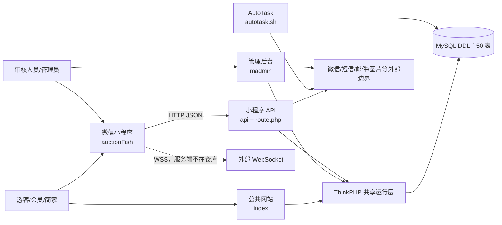
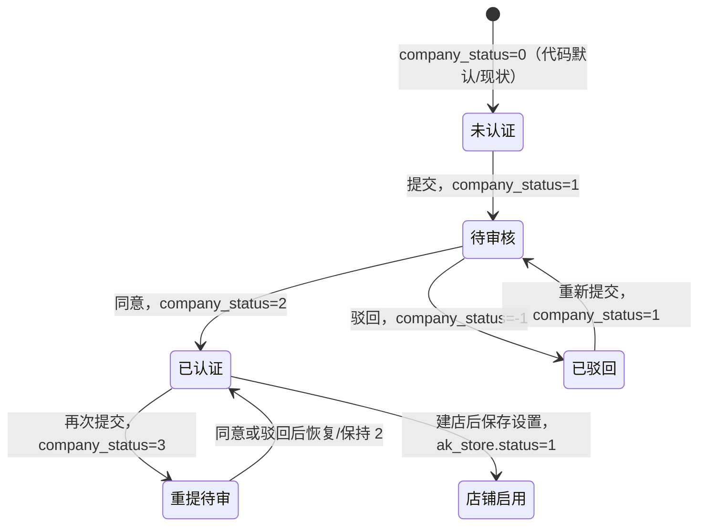
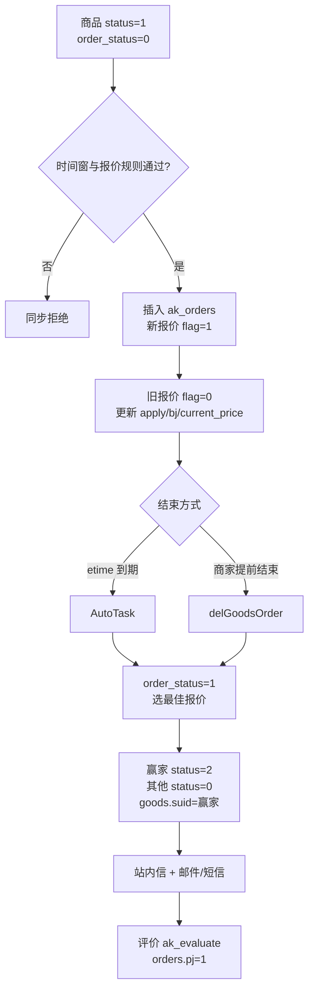

# 开拍鱼全系统功能与业务流程分析报告

## 1. 文档信息

| 项目 | 内容 |
|---|---|
| 分析日期 | 2026-08-06（UTC） |
| Git HEAD | `43286d23fac29c0eb3bc4db40a8efa330c182c8e` |
| 分析方式 | 仅对当前检出源码及数据库 DDL 做静态分析；未运行 PHP、未连接 MySQL、未启动服务、未构建小程序、未请求生产接口、未连接 WebSocket |
| 事实来源 | `auctionFish/**`；`tp/application/api/**`；`tp/application/madmin/**`；`tp/application/index/**`；`tp/application/{common,config,database,route,command,tags}.php`；`tp/autotask.sh`；`db/**/*.sql` 中的 `CREATE TABLE` |
| 导航来源 | `project-map.json` 的 lookup、flows、coverage、uncertainties；所有用于结论的地图记录均回到源码或 DDL 核对，地图本身不作为最终证据 |
| 工作区基线 | 分析开始时工作区已非干净状态：`MD/00-README.md` 至 `MD/07-修复优先级与路线图.md` 共 8 个受跟踪文档已删除；`AGENTS.md`、`CLAUDE.md`、`project-map.json` 及 5 个提示词文档为未跟踪文件。本报告未恢复、清理或改写这些既有内容 |
| 本次变更边界 | 只新增 `MD/system-features-business-processes-zh.md`；未修改业务代码、SQL、配置、地图或其他文档 |
| 数据安全 | 未读取或引用 SQL `INSERT` 行数据、`tp/uploads/**`、日志和用户上传内容；凭据、密钥、令牌和个人数据均不写入，敏感配置值统一视为 `redacted` |

### 1.1 覆盖结果

本次从源码重新计数并与导航索引交叉核对：小程序声明页面 49 个、第一方组件 37 个、显式路由声明 161 条、API public action 84 个、管理后台 public action 156 个、公共网站 public method 81 个（其中 4 个为 `_initialize` 生命周期钩子，余下 77 个为业务 action）、网站 widget 9 个、管理后台 HTML 85 个、公共网站唯一 HTML 62 个（地图记录 64 条，含 2 个重复路径）、定时命令 1 个、DDL 表 50 张。`project-map.json` 中登记的 329 项功能候选被分解为 87 项小程序/API/任务核心能力、156 项后台能力和 86 项网站 action/widget，并在第 5 节全部列明。

DDL 显示 50 张表混用 MyISAM 与 InnoDB，没有声明外键；代码依靠 `uid`、`storeid`、`goods_id`、`orderid` 等字段约定关联。该事实会直接影响竞拍、删除、注销、审核等跨表流程的一致性判断。证据：`db/openxbid_com_2026-04-11_16-51-07_mysql_data_nSctE.sql` — 全部 `CREATE TABLE`；其中 `ak_goods` 为 MyISAM，仅声明主键和 `etime` 索引。

### 1.2 状态口径

- `已闭环`：在该原子能力适用范围内，入口、权限、校验、处理、持久化、反馈和可恢复终态均能由仓库证明。
- `部分闭环`：主路径存在，但权限、关联一致性、失败恢复、并发、后台承接或终态至少缺一项。
- `未形成闭环`：只有客户端、路由或零散数据操作，无法完成目标。
- `外部闭环未知`：关键成功保证依赖仓库外服务，源码只能证明调用端。
- `遗留/未使用`：代码存在，但当前入口、路由或 DDL 证明它未被当前主链使用。
- `无法确认`：源码与 DDL 冲突或部署数据缺失；本报告同时给出验证办法。

表中的状态是“业务闭环评级”，不是简单的“是否写了代码”。例如，`feat.web.Orders.quot` 的方法确实存在，但正常返回之后的价格同步代码不可达，因此只能评为 `部分闭环`。

## 2. 客户摘要

开拍鱼当前是一套以微信小程序为主要客户端、兼有公共网站和管理后台的双向询报价/竞拍平台。代码支持用户注册登录、个人或企业认证、店铺启用、出售或求购信息发布、升价或降价报价、文章与社区互动、商家咨询、服务资质申请、平台审核、消息通知和基础资料维护。后台还具备会员、店铺、商品、内容、服务资料、平台配置和角色权限的管理入口。

可以明确对客户说明的成果是：主要页面、API、后台屏幕和核心数据结构都已落地；浏览搜索、资料查询、内容阅读、店铺展示、报价记录、个人中心、站内消息、资质审核入口和定时结拍入口均有真实代码。小程序的 49 个页面全部存在，78 条客户端 HTTP 调用链可解析到仓库内处理器，另有 2 条启动请求只有客户端、没有仓库内服务端实现。

但按生产级“完整闭环”标准，认证后开店、商品全生命周期、竞拍成交、服务资质、内容举报、咨询实时送达、账号注销以及后台权限等主业务链目前只能评为 `部分闭环` 或 `外部闭环未知`，不能整体承诺为已闭环。最重要的断点是：

1. 多个修改或删除 action 没有证明对象属于当前用户，正常业务可能越过对象边界。
2. 出价、提前结拍、定时结拍和通知不在同一事务或可重试状态机内；并发或中途失败后可能出现价格、赢家、状态和通知不一致。
3. 小程序令牌没有代码可见的过期时间；启动依赖的 `getLangByIp`、`getServerTime` 没有路由或处理器；WebSocket 只有客户端。
4. 认证和服务审核各有“小程序审核员”和“管理后台”两套独立写路径，没有防重复决定或统一审计链。
5. 公共网站复制了报价、认证、店铺等规则，其中网站报价的价格更新代码不可达，网站改密会提前返回；部分网站/后台代码还引用 DDL 不存在的表或字段。
6. 举报/反馈可以入库且后台可以标记处理，但没有给提交者的处理结果反馈；附件界面与服务端实际落库不一致。

因此，当前系统适合表述为“核心功能框架和多数正常入口已实现，关键交易与运营流程仍需补齐一致性、权限、异常恢复和外部服务交付证据后，才能达到生产闭环标准”。

## 3. 系统组成与边界

| 系统 | 当前职责 | 主要入口与证据 | 可证明边界 |
|---|---|---|---|
| 微信小程序 | 主客户入口；浏览、发布、报价、个人中心、店铺、内容、消息、服务和审核 | `auctionFish/app.json`；`auctionFish/app.js`；`auctionFish/pages/**`；`auctionFish/custom-tab-bar/**` | 49 个声明页面均有文件；5 个 tab 为“首页、分类、发布、信息、我”；声明 `scope.userLocation` 与 `scope.writePhotosAlbum`，仅后者找到实际调用 |
| HTTP API | 小程序 JSON 服务；每个 action 自行读取 token 并调用 `checkToken()` | `tp/application/route.php`；`tp/application/api/controller/*.php` | 83 条非根 API 路由可对应 action；API 根路由指向不存在的 `Home::index`；`Home::products` 有方法但无当前客户端入口 |
| 管理后台 | 登录、角色权限、审核、会员/店铺/商品/内容/资料/配置维护及导入 | `tp/application/madmin/controller/Base.php`；`Login.php`；29 个有 action 的控制器及视图 | Session 登录可证明；按 `module/controller/action` 查询 `ak_rules`，但仓库没有规则行数据，无法证明每个 action 的实际授权覆盖 |
| 公共网站 | 服务端渲染的首页、商品/店铺、内容、会员中心和商家管理 | `tp/application/index/controller/**`；`tp/application/index/view/**`；全局路由 | 与小程序存在第二套登录、报价、收藏、关注、认证和商家链；规则有差异；购物车/普通订单分支依赖缺失 DDL |
| 共享层 | 邮件、短信、上传、系统消息、会员编号、配置和数据库连接 | `tp/application/common.php`；`tp/application/api/common.php`；`config.php`；`database.php` | 能证明调用代码，不能证明部署凭据、网关 SLA、图片域名映射和真实发送结果 |
| 定时任务 | 扫描过期竞拍，确定赢家并通知 | `tp/application/api/command/AutoTask.php` — `AutoTask::doWork`；`tp/application/command.php`；`tp/autotask.sh` | 脚本设计为每分钟执行三次；仓库不能证明计划进程正在运行，也没有事务、锁、补偿队列或可靠重试 |
| 数据库 | 会员、店铺、商品、出价、内容、消息、审核、配置与参考数据 | `db/openxbid_com_2026-04-11_16-51-07_mysql_data_nSctE.sql` | 仅以 DDL 为证；50 表、415 列、0 个声明外键、混合存储引擎；不以 dump 中业务数据作为证据 |
| 外部服务 | 微信登录/手机号/内容审核/小程序码、短信、SMTP、WebSocket、图片访问 | `Login.php`；`api/common.php`；`application/common.php`；`utils/websocket.js` | 只验证调用方；外部服务端、运行状态、回调、重试和交付保证均不在仓库内 |

## 4. 角色与权限矩阵

| 角色 | 进入条件 | 可触发能力 | 代码可见限制与边界 | 证据 |
|---|---|---|---|---|
| 游客 | 无 token/session | 首页、商品/店铺/文章/社区与参考资料浏览；进入登录 | 收藏、关注、评论、报价、发布、个人中心等需要 token；网站公开页另走 Session 体系 | `auctionFish/pages/tabbar/home/home.js`；`api/Home::getHomeDatas`；`api/Good::getGoodsDatas`；`index/Index.php`；`index/Product.php` |
| 普通会员 | 小程序 token 可被 `checkToken()` 解码，或网站 Session 中存在会员 | 资料、收藏、关注、咨询、评论、举报、验证码绑定、认证申请和部分报价入口 | API 没有统一控制器 guard；各 action 自行检查。token 载荷没有代码可见的 `exp`；部分 action 只检查登录、不检查对象关系 | `tp/application/api/common.php` — `createToken/checkToken`；各 API action；`index/controller/Member.php::_initialize` |
| 待审/驳回/重提会员 | `ak_member.company_status` 为代码中的 `1`、`-1` 或 `3` | 查看申请状态、重新提交；进入审核队列 | 具体语义由各 action 分支定义；重提被拒时有路径恢复为 `2`，两套审核入口可能重复决定 | `api/Good::setGrApprove/setQyApprove`；`api/Message::setReviewOperat`；`madmin/Member::checkst` |
| 已认证会员/商家 | 多数发布接口要求 `company_status>=2`；网站部分入口要求 `company_status==2` | 店铺设置、商品/文章/动态发布、服务申请、收到咨询、评价管理 | 小程序出价中的企业认证限制被注释，发布与删除等对象级检查并不一致；网站与 API 的阈值不同 | `api/Good::setGoodsAddDatas/setGoodsQuot`；`api/Article::setArtAddDatas`；`api/Dt::setDtAddDatas`；`index/Store.php` |
| 企业服务商 | `company_type=2`、店铺启用，且存在服务选择/资质记录 | 提交增值服务资质、审核通过后进入服务商目录 | `setStoreDcDatas` 的组合条件不足以严格证明企业且已通过认证；目录筛选在无服务参数时并未强制具体 `fwtype` | `api/Store::getStoreDcDatas/setStoreDcDatas`；`api/Orders::getOrderDatas` 的 `action=8` |
| 小程序审核人员 | 已登录且 `ak_member.gl=1` | 查看认证/服务申请队列、详情、同意或驳回 | 与后台审核 action 独立写相同状态；无统一领取、版本号或防重复决定 | `auctionFish/pages/my/pages/review/**`；`api/Message::getReviewInfo/getReviewDetail/setReviewOperat` |
| 后台管理员 | `session("admin")` 存在且账号状态满足登录逻辑 | 业务管理、认证/服务审核、配置、导入和权限管理 | 若当前 action 在 `ak_rules` 没有匹配行，`Base::checkLogin` 不会进一步要求 `ak_group_rule`；实际规则行不在仓库，覆盖无法确认 | `madmin/Login::loginDo`；`madmin/Base::checkLogin`；DDL `ak_admin/ak_rules/ak_group_rule` |
| 超级管理员 | 后台代码对管理员 `id=1` 有菜单/权限特例 | 可见全部菜单及角色权限维护 | 真实生产账号和规则数据未读取，不能证明部署中的实际主体 | `madmin/Index::index`；`madmin/Group.php`；`madmin/Auth.php` |
| 定时任务 | 外部进程执行 `php think AutoTask` | 关闭过期竞拍、选定赢家、写站内消息、触发邮件/短信 | 无服务身份、分布式锁、事务和补偿状态；运行与调度只能在部署环境验证 | `tp/autotask.sh`；`api/command/AutoTask.php` |
| 外部服务 | 微信、短信、SMTP、WSS 或图片服务可达且配置有效 | 换取 openid/手机号、内容审核、验证码与业务通知、实时消息、图片访问 | 仓库只包含调用端；失败交付、回调、重试、配额和可用性不能确认 | `api/controller/Login.php`；`api/common.php`；`application/common.php`；`auctionFish/utils/websocket.js` |

## 5. 全量功能总表

### 5.1 阅读说明与完整性

下列三组登记覆盖 `project-map.json` 的全部 329 个功能候选，并已依据源码复核。为避免 156 个结构相同的后台 action 重复粘贴同一句说明，后台和网站采用“控制器 + 明列每个原子 action”的登记方式：每个 action 仍有独立功能 ID、中文名称、入口和方法；共享的权限、表、失败边界与证据只在同一控制器行写一次，不表示把多个 action 合并成一个功能。

### 5.2 小程序、API、任务核心能力（87 项）

| 功能 ID | 中文原子能力 | 入口、角色与前置条件 | 服务端规则、关键数据、结果和失败分支 | 状态 | 证据 |
|---|---|---|---|---|---|
| `feat.auth.exchangecode` | 微信 code 换 token | 小程序启动/登录；游客提交 `wx.login` code | `Login::index` 调微信 `jscode2session`，按 `openid` 查 `ak_member` 并签发 JWT；无 `openid` 时返回空值，JWT 无代码可见过期声明 | 部分闭环 | `auctionFish/app.js`；`v1/getToken`；`api/Login::index`；`api/common.php — createToken` |
| `feat.auth.login` | 验证码或密码登录 | 登录页；手机号/邮箱、区号和登录方式 | `Login::loginDo` 校验验证码缓存或密码，验证码路径可创建会员并写欢迎 `ak_info`；禁用会员拒绝；token 失效由请求封装清本地存储并跳登录，但无服务端吊销/刷新闭环 | 部分闭环 | `pages/tabbar/login/login.js`；`v1/getLogin`；`api/Login::loginDo`；`utils/request.js` |
| `feat.auth.sendverificationcode` | 发送验证码 | 登录、换手机、换邮箱页；60 秒内禁止重发 | 生成验证码并缓存 600 秒，调用国内/国际短信或 SMTP；外部网关返回失败时给通用错误，真实送达与重试不在仓库 | 外部闭环未知 | `v1/getVcode`；`api/Login::sendTel`；`application/common.php — sendSMS/sendSingleIMS/send_email` |
| `feat.auth.wechatphonelogin` | 微信手机号授权登录 | 登录页授权按钮；微信返回 code | 取微信 access token 和手机号，创建或更新 `ak_member` 并写欢迎消息；外部接口失败要求重新授权；access token 缓存首次获取路径会 `exit` | 外部闭环未知 | `v1/getauthorLogin`；`api/Login::authorLogin`；`api/common.php — getAccessToken` |
| `feat.member.account.cancel` | 注销账号 | “系统设置”；已登录用户确认 | 物理删除 `ak_member` 及代码列出的店铺、内容、互动、竞拍、消息等关联行；无事务、无完整关系约束、无 token 吊销，也不能证明遗漏表归档与恢复 | 部分闭环 | `pages/my/pages/system/index.js`；`v1/cancelAccount`；`api/My::cancelAccount` |
| `feat.member.avatar.upload` | 上传头像 | 个人资料页；已登录 | 接收文件并更新 `ak_member` 头像字段；图片实际存储/域名交付依赖部署，失败补偿不可验证 | 外部闭环未知 | `pages/my/pages/info/index.js`；`v1/uploadFile`；`api/My::uploadFile` |
| `feat.member.collections.list` | 查询个人业务清单/服务商目录 | 我的竞拍、关注、收藏、名片、分类页；按 `action` 分支 | `Orders::getOrderDatas` 复用一个接口查询中标、关注、商品/文章收藏、服务商、自己开放商品等；`action=8` 无具体服务筛选时目录约束不完整 | 部分闭环 | `v1/getOrderDatas`；`api/Orders::getOrderDatas`；`ak_orders/ak_goods/ak_follow/ak_collect/ak_article_sc/ak_store_serve` |
| `feat.member.mail.change` | 换绑邮箱 | 邮箱页；验证码有效且新邮箱未占用 | 更新 `ak_member.mail` 并写系统消息；验证码发送依赖 SMTP，缺少统一会话吊销/失败补偿 | 部分闭环 | `pages/my/pages/mail/index.js`；`v1/setMyMail`；`api/My::setMyMail` |
| `feat.member.phone.change` | 换绑手机号 | 手机页；验证码有效且号码未占用 | 更新分支从已判定为假值的 `$res` 读取 `$res['id']` 作为主键，源码不能证明调用者记录会被更新 | 未形成闭环 | `pages/my/pages/mobile/index.js`；`v1/setMyPhone`；`api/My::setMyPhone` |
| `feat.member.profile.read` | 查看本人资料 | “我”、资料、认证、系统、手机、邮箱页；已登录 | 按 token 用户读取 `ak_member` 与店铺摘要并返回；失败返回登录/数据错误 | 已闭环 | `v1/getmyInfo`；`api/My::info`；`ak_member/ak_store` |
| `feat.member.profile.update` | 修改昵称或密码 | 个人资料页；已登录 | 更新 `ak_member`，昵称经过微信文本审核；同一 action 兼有改密，未形成旧密码验证、会话失效和外部审核可恢复链 | 部分闭环 | `v1/setmyInfo`；`api/My::setInfo` |
| `feat.member.verification.form` | 加载认证表单 | 认证申请页；已登录 | 返回会员当前认证数据和 `ak_region` 选项；只读结果可反馈 | 已闭环 | `v1/getRegion`；`api/Good::getRegion` |
| `feat.member.verification.individual` | 提交个人认证 | 个人认证表单；已登录 | 校验材料并经微信文本审核，写 `ak_member.company_type=1`、申请数据及 `company_status=1`，已通过者重提为 `3`，再短信提醒运营；审核并发未闭合 | 部分闭环 | `v1/setGrApprove`；`api/Good::setGrApprove`；`ak_member` |
| `feat.member.verification.company` | 提交企业认证 | 企业认证表单；已登录 | 与个人链类似，写 `company_type=2`、企业材料及 `company_status=1/3`；后续由两套审核入口处理 | 部分闭环 | `v1/setQyApprove`；`api/Good::setQyApprove`；`ak_member` |
| `feat.store.contactcard.delete` | 删除店铺联系人 | 店铺名片页；有效 token | 删除指定 `ak_store_lx`；认证 guard 使用 `&&` 且未证明联系人属于当前用户店铺 | 部分闭环 | `v1/setStoreLxDel`；`api/Store::setStoreLxDel` |
| `feat.store.contactcard.form` | 读取联系人表单 | 联系人编辑页；有效 token | 按传入 id 读取 `ak_store_lx`；同一错误 guard 且缺对象归属校验 | 部分闭环 | `v1/getStoreLx`；`api/Store::getStoreLx` |
| `feat.store.contactcard.save` | 新增或编辑联系人 | 联系人编辑页；填写姓名/联系方式等 | 写 `ak_store_lx`；已有 id 的更新未证明属于当前店铺，认证条件也未正确生效 | 部分闭环 | `v1/setStoreLx`；`api/Store::setStoreLx`；`ak_store_lx` |
| `feat.store.contactcard.view` | 查看店铺名片 | 店铺名片页；游客或会员 | 聚合店铺、认证会员、地区、分类、关注及联系人并展示；只读主路径存在 | 已闭环 | `v1/getStoreLxInfo`；`api/Store::getStoreLxInfo` |
| `feat.store.follow.toggle` | 关注/取消关注店铺 | 商品、店铺、文章、关注和分类页；已登录 | 增删 `ak_follow` 并同步 `ak_store.fans`；两步无事务，并发/重复请求可能造成计数与关系不一致 | 部分闭环 | `v1/setStoreGz`；`api/Store::setStoreGz`；`ak_follow/ak_store` |
| `feat.store.followers.list` | 查看粉丝列表 | 我的粉丝页；已认证且有店铺 | 按本人店铺查 `ak_follow` 及会员摘要并分页 | 已闭环 | `v1/getmyFans`；`api/My::getmyFans` |
| `feat.store.followers.notifications` | 查看新增粉丝通知 | “关注通知”页；已登录商家 | 查询关注关系并标记已查看，页面获得列表结果 | 已闭环 | `v1/getmyGzs`；`api/Message::getmyGzs`；`ak_follow.status` |
| `feat.store.followers.remove` | 移除粉丝 | 粉丝/通知页；商家操作 | 删除 `ak_follow` 并调整粉丝数；缺事务和明确对象级约束，重复操作恢复路径不足 | 部分闭环 | `v1/delmyFans`；`api/My::delmyFans` |
| `feat.store.profile.view` | 查看店铺资料 | 店铺资料页；游客或会员 | 读取 `ak_store`、会员、地区、分类并返回 | 已闭环 | `v1/getStoreInfo`；`api/Store::getStoreInfo` |
| `feat.store.settings.form` | 加载店铺设置 | 店铺设置页；认证会员 | 读取本人店铺、地区、类别和服务选择；如果会员尚无 `ak_store` 行，方法会落到末尾而不返回 JSON | 部分闭环 | `v1/getStore`；`api/Store::getStore`；DDL `ak_store` |
| `feat.store.settings.save` | 保存并启用店铺 | 店铺设置页；认证会员 | 更新 `ak_store` 并设 `status=1`；先取消全部 `ak_store_serve` 再插入/恢复选择，写系统消息；跨表无事务，可能让既有已批资质退出目录 | 部分闭环 | `v1/setStore`；`api/Store::setStore`；`ak_store/ak_store_serve/ak_info` |
| `feat.store.tabs.list` | 浏览店铺主页各 tab | 店铺主页；游客/会员 | 按 sale/buy/评价/动态分支返回商品、评价或动态 | 已闭环 | `v1/getStoreListDatas`；`api/Store::getStoreListDatas` |
| `feat.goods.comments.create` | 发表商品评论 | 商品评论页；已登录 | 文本经微信审核后写 `ak_goods_reviews`；外部审核首次 token 获取可中断，缺少重试/草稿 | 外部闭环未知 | `v1/setGoodsReviews`；`api/Good::setGoodsReviews` |
| `feat.goods.comments.list` | 查看商品评论 | 商品详情/评论页 | 按 `goods_id` 查询评论与会员信息 | 已闭环 | `v1/getGoodsReviews`；`api/Good::getGoodsReviews` |
| `feat.goods.delete` | 删除商品 | 我的商品管理页；代码要求认证会员 | 删除商品及出价、收藏、评论、评价；未验证商品属于当前用户，且跨 MyISAM/InnoDB 无事务 | 部分闭环 | `v1/setGoodsDelDatas`；`api/Good::setGoodsDelDatas` |
| `feat.goods.detail` | 查看商品详情 | 商品详情页；游客/会员 | 查询 `status=1` 商品，累计浏览，返回店铺、规格、出价、评论、收藏关注状态 | 已闭环 | `v1/getGoodsDatas`；`api/Good::getGoodsDatas`；`ak_goods` |
| `feat.goods.favourite.toggle` | 收藏/取消收藏商品 | 商品、收藏、分类页；已登录 | 增删 `ak_collect`；联合主键抑制同用户同商品重复，但失败反馈和关联商品删除的一致性仅部分覆盖 | 部分闭环 | `v1/setGoodssc`；`api/Good::setGoodssc`；`ak_collect` |
| `feat.goods.manage.list` | 查看自己发布的商品 | 商品管理页；认证会员 | 按本人 `uid` 与运行/结束状态分页读取 `ak_goods` | 已闭环 | `v1/getGoodsLists`；`api/Good::getGoodsLists` |
| `feat.goods.publish.form` | 加载商品发布/编辑表单 | 发布/编辑页；认证会员 | 返回分类、地区、当前商品和表单选项；传入 `goodsId` 时未证明商品属于调用者 | 部分闭环 | `v1/getGoodsAddDatas`；`api/Good::getGoodsAddDatas` |
| `feat.goods.publish.submit` | 发布、编辑或重新发布商品 | 发布页；`company_status>=2`；每天新发/重发最多 5 条 | 校验分类、图片、规格、日期、币种和价格，经微信审核后插入/更新 `ak_goods`，写 `status=1/order_status=0/current_price`；按传入 id 更新时未证明归属，无审核队列和事务 | 部分闭环 | `v1/setGoodsAddDatas`；`api/Good::setGoodsAddDatas` |
| `feat.goods.search` | 浏览、搜索、排序和筛选商品 | 首页/商品列表；游客/会员 | 服务端按关键词、地区、分类、买卖方向和排序分页查询可见商品 | 已闭环 | `v1/getGoodsListDatas`；`api/Good::getGoodsListDatas` |
| `feat.bidding.closeearly` | 提前结束竞拍 | 我的发布/分类页；商家 | 设 `order_status=1`、`etime=now`，选择赢家并通知；未验证商品归属，且错误读取未定义 `$val['btype']`，会固定走升序分支 | 部分闭环 | `v1/delGoodsOrder`；`api/Orders::delGoodsOrder` |
| `feat.bidding.detail` | 查看本人报价详情 | 报价详情页；已登录 | 按 `ordId` 读取 `ak_orders` 与商品；处理器未证明该订单属于调用者 | 部分闭环 | `v1/getOrderInfo`；`api/Orders::getOrderInfo` |
| `feat.bidding.ladder.view` | 查看报价阶梯 | 商品报价列表页 | 按商品返回全部 `ak_orders` 报价及规格明细；未过滤 `flag/status`，且空 token 仍被解码使用 | 部分闭环 | `v1/getGoodsOffers`；`api/Good::getGoodsOffers` |
| `feat.bidding.placebid` | 提交报价 | 商品详情/报价详情；已登录、在时间窗口内、每个规格均报价且优于当前价 | 插入 `ak_orders`，调整旧报价 `flag`，更新 `ak_goods.apply/bj/current_price` 并触发邮件/短信；未检查卖家自报、商品 `status/order_status`，无并发锁和事务 | 部分闭环 | `v1/setGoodsQuot`；`api/Good::setGoodsQuot`；`ak_goods/ak_orders` |
| `feat.bidding.withdraw` | 撤回报价 | 我的竞拍/报价详情；报价属于本人 | 删除 `ak_orders` 并减少 `ak_goods.apply`；评价清理用 `ak_evaluate.id=ordId` 而创建时订单号写在 `orderid`，价格/最佳报价未重算 | 部分闭环 | `v1/delOrder`；`api/Orders::delOrder` |
| `feat.job.autoclose` | 定时结束到期竞拍 | `autotask.sh` 外部进程；筛选 `order_status=0` 且 `etime<now` | 先锁定商品，再按 `btype` 选有效最佳报价，写赢家与订单状态，发送站内信/邮件/短信；状态与通知非事务，崩溃后不再重试，异常捕获也不完整 | 部分闭环 | `api/command/AutoTask::doWork`；`tp/autotask.sh`；`ak_goods/ak_orders/ak_info` |
| `feat.mp.getservertime` | 获取服务端时间 | `app.js` 启动请求 | 客户端请求 `v1/getServerTime`，仓库无路由、无 action | 未形成闭环 | `auctionFish/app.js`；`tp/application/route.php`（无对应声明） |
| `feat.evaluation.create` | 成交后评价店铺 | 报价详情页；已登录 | 插入 `ak_evaluate`，按固定基数重新计算 `ak_store.pf`，把订单 `pj=1`；未证明订单属于调用者、已中标、未评价，重复与并发不闭合 | 部分闭环 | `v1/setOrderPJ`；`api/Orders::setOrderPJ` |
| `feat.evaluation.delete` | 商家删除评价 | 店铺评价页；认证检查存在 | 删除评价；认证 guard 使用错误 `&&`，且未证明评价属于当前商家店铺 | 部分闭环 | `v1/setOrderPJDel`；`api/Orders::setOrderPJDel` |
| `feat.evaluation.merchant.list` | 查看收到的店铺评价 | 店铺评价页；商家 | 读取本人店铺评价、用户与商品；guard 条件错误，但只读主路径存在 | 部分闭环 | `v1/getOrderPJDatas`；`api/Orders::getOrderPJDatas` |
| `feat.evaluation.reply` | 商家回复评价 | 店铺评价页；商家 | 更新指定评价的回复字段；未证明评价属于当前店铺 | 部分闭环 | `v1/setOrderPJReply`；`api/Orders::setOrderPJReply` |
| `feat.article.comment` | 评论文章 | 文章详情页；已登录 | 微信审核后写 `ak_article_pl` 并更新评论计数；外部失败没有草稿/重试 | 外部闭环未知 | `v1/setArtPl`；`api/Article::setArtPl` |
| `feat.article.delete` | 删除文章 | 我的发布；认证会员 | 删除文章及关联互动；未证明文章属于当前用户 | 部分闭环 | `v1/setArtDelDatas`；`api/Article::setArtDelDatas` |
| `feat.article.detail` | 阅读文章 | 文章详情/关于页 | 返回文章、作者店铺、评论与互动状态 | 已闭环 | `v1/getArtDatas`；`api/Article::getArtDatas` |
| `feat.article.favourite.toggle` | 收藏/取消收藏文章 | 文章详情/收藏页；已登录 | 增删 `ak_article_sc` | 部分闭环 | `v1/setArtSc`；`api/Article::setArtSc` |
| `feat.article.feed` | 浏览文章列表 | 信息 tab 新闻列表；游客/会员 | 分页查询可见文章并联店铺 | 已闭环 | `v1/getArtListDatas`；`api/Article::getArtListDatas` |
| `feat.article.like.toggle` | 点赞/取消点赞文章 | 文章详情；已登录 | 增删 `ak_article_zan` 并调整文章计数；关系与计数分步写 | 部分闭环 | `v1/setArtZan`；`api/Article::setArtZan` |
| `feat.article.own.list` | 查看自己发布的文章 | 我的发布；认证会员 | 按本人 `uid` 分页查 `ak_article` | 已闭环 | `v1/getArtLists`；`api/Article::getArtLists` |
| `feat.article.publish.form` | 加载文章编辑器 | 文章发布/编辑页；认证会员 | 按传入 `artId` 返回已有文章编辑数据，但未证明文章属于调用者 | 部分闭环 | `v1/getArtAddDatas`；`api/Article::getArtAddDatas` |
| `feat.article.publish.submit` | 发布或编辑文章 | 编辑器；认证会员；每天最多 5 条 | 微信审核后直接写 `status=1`；按 id 编辑未证明归属，无后台内容预审和审核失败恢复 | 部分闭环 | `v1/setArtAddDatas`；`api/Article::setArtAddDatas` |
| `feat.community.comment` | 评论社区动态 | 信息 tab/动态详情；已登录 | 微信审核后写 `ak_dt_pl` 并更新计数 | 外部闭环未知 | `v1/setDtPl`；`api/Dt::setDtPl` |
| `feat.community.feed` | 浏览社区动态 | 信息 tab；游客/会员 | 返回动态流，并排除当前用户在 `ak_dt_nosee` 中屏蔽的店铺 | 已闭环 | `v1/getDtListDatas`；`api/Dt::getDtListDatas` |
| `feat.community.forward.count` | 记录动态转发次数 | 动态详情分享 | 更新动态转发计数；不证明外部分享完成，重复触发无去重 | 部分闭环 | `v1/setDtZf`；`api/Dt::setDtZf` |
| `feat.community.like.toggle` | 点赞/取消点赞动态 | 信息 tab/动态详情；已登录 | 增删 `ak_dt_zan` 并更新计数；两步无事务 | 部分闭环 | `v1/setDtZan`；`api/Dt::setDtZan` |
| `feat.community.mutestore` | 屏蔽/取消屏蔽店铺动态 | 信息 tab；已登录 | 增删 `ak_dt_nosee`，后续 feed 排除对应 `storeid` | 已闭环 | `v1/setDtNosee`；`api/Dt::setDtNosee` |
| `feat.community.own.list` | 查看自己发布的动态 | 我的发布；认证会员 | 按本人 `uid` 分页查询 `ak_dt` | 已闭环 | `v1/getDtLists`；`api/Dt::getDtLists` |
| `feat.community.post.delete` | 删除动态 | 我的发布；认证会员 | 删除动态及互动；未证明动态属于调用者 | 部分闭环 | `v1/setDtDelDatas`；`api/Dt::setDtDelDatas` |
| `feat.community.post.detail` | 阅读动态详情 | 动态详情页 | 返回动态、店铺、评论及互动状态 | 已闭环 | `v1/getDtDatas`；`api/Dt::getDtDatas` |
| `feat.community.post.form` | 加载动态编辑器 | 动态发布/编辑页；认证会员 | 按传入 `dtId` 返回已有动态编辑数据，但未证明动态属于调用者 | 部分闭环 | `v1/getDtAddDatas`；`api/Dt::getDtAddDatas` |
| `feat.community.post.submit` | 发布或编辑动态 | 编辑器；认证会员 | 微信审核后直接写 `ak_dt.status=1`；按 id 编辑未证明归属，无后台预审 | 部分闭环 | `v1/setDtAddDatas`；`api/Dt::setDtAddDatas` |
| `feat.messaging.bidnotifications` | 查看报价通知 | “报价消息”页；已登录 | 查询与本人商品/报价相关的 `ak_orders/ak_goods` 并更新查看标识 | 已闭环 | `v1/getMyOrderDatas`；`api/Message::getMyOrderDatas` |
| `feat.messaging.conversations.received` | 查看商家收到的咨询 | “收到的咨询”页；商家 | 以店铺视角聚合咨询会话、最新消息和未读数 | 已闭环 | `v1/getStoreConsults`；`api/Message::getStoreConsults` |
| `feat.messaging.conversations.sent` | 加载信息中心 | 信息 tab；已登录 | 以买家视角聚合咨询、系统消息、文章/动态入口及未读信息 | 已闭环 | `v1/getMyConsults`；`api/Message::getMyConsults` |
| `feat.messaging.systemmessages.list` | 查看系统消息 | 系统消息页；已登录 | 读取本人 `ak_info` 并标记已读 | 已闭环 | `v1/getMySysInfos`；`api/Message::getMySysInfos` |
| `feat.messaging.thread.read` | 打开咨询会话并标记已读 | 聊天页；买家传 `storeId`，商家传 `uId` | 按用户与店铺对读取 `ak_consult`，将对方消息设已读；店铺视角的对象归属证明不足 | 部分闭环 | `v1/chat`；`api/Message::chat` |
| `feat.messaging.thread.send` | 发送咨询消息 | 聊天页；已登录 | 微信审核后以买家 `type=1` 或商家 `type=2` 插入 `ak_consult.status=0`；仓库无服务端推送实现 | 外部闭环未知 | `v1/setChatMsg`；`api/Message::setChatMsg`；`utils/websocket.js` |
| `feat.messaging.unreadcounts` | 轮询未读计数 | 各 tab 页面加载/刷新；已登录 | 聚合系统消息、咨询、报价和关注未读数并更新自定义 tab bar；实时事件依赖外部 WSS，轮询时机不保证即时 | 部分闭环 | `v1/getMessageCounts`；`api/Home::getMessageCounts`；`custom-tab-bar/index.js` |
| `feat.service.importdata.search` | 查询海关统计资料 | 服务“进口”页 | 查询 `ak_service_t4` 并返回统计参考数据；资料新鲜度依赖后台导入 | 已闭环 | `v1/getSeviceT4Datas`；`api/Services::getSeviceT4Datas` |
| `feat.service.qualification.form` | 加载服务资质表单 | 店铺服务资质页；已登录 | 读取本人店铺、已选服务及资质记录；未选择服务时拒绝 | 已闭环 | `v1/getStoreDcDatas`；`api/Store::getStoreDcDatas` |
| `feat.service.qualification.submit` | 提交服务资质 | 资质页；应为企业已认证商家且已选择服务 | 写公司、证明材料、特定服务所需备案号和 `status=1`，通知运营；组合 guard 不足以严格证明前置身份，审核两套路径无防重复 | 部分闭环 | `v1/setStoreDcDatas`；`api/Store::setStoreDcDatas`；`ak_store_serve` |
| `feat.service.ratetable.view` | 查看服务费率 | 服务费率页 | 读取启用的 `ak_service_t1` | 已闭环 | `v1/getSeviceT1Datas`；`api/Services::getSeviceT1Datas` |
| `feat.service.synergy.view` | 查看协同服务说明 | 协同服务页 | 读取 `ak_service_t2` 富文本 | 已闭环 | `v1/getSeviceT2Datas`；`api/Services::getSeviceT2Datas` |
| `feat.service.tariff.search` | 查询关税资料 | 关税查询页 | 按条件查询 `ak_service_t3`；资料新鲜度依赖后台导入 | 已闭环 | `v1/getSeviceT3Datas`；`api/Services::getSeviceT3Datas` |
| `feat.moderation.queue.list` | 小程序审核队列 | 我的审核页；`ak_member.gl=1` | 查询个人/企业认证和服务申请待审项 | 部分闭环 | `v1/getReviewInfo`；`api/Message::getReviewInfo` |
| `feat.moderation.detail` | 查看审核详情 | 审核详情页；`gl=1` | 按类型读取会员/服务资质材料；部分查询返回整行，具体响应字段需动态核验 | 部分闭环 | `v1/getReviewDetail`；`api/Message::getReviewDetail` |
| `feat.moderation.decide` | 同意或驳回认证/服务申请 | 审核详情；`gl=1` | 认证同意写 `company_status=2` 并按需建店；服务同意写 `status=2`；驳回写 `-1` 或恢复 `2`，写站内信并发邮件/短信；与后台 action 独立、无并发控制 | 部分闭环 | `v1/setReviewOperat`；`api/Message::setReviewOperat` |
| `feat.feedback.submit` | 提交反馈或内容举报 | 反馈/举报页；已登录 | 校验标题、内容、联系方式后写 `ak_platform_msg`，可带 `artid/dtid`；联系校验条件误写，页面附件没有写入 `pic`，后台处理后不通知提交人 | 部分闭环 | `v1/setMyFeedback`；`api/My::setMyFeedback`；`ak_platform_msg` |
| `feat.mp.getlangbyip` | 按 IP 获取语言 | `app.js` 启动 | 客户端请求 `v1/getLangByIp`，仓库无路由和处理器；共享 `get_ip_nation()` 也无调用 | 未形成闭环 | `auctionFish/app.js — detectLanguageByIP`；`application/common.php — get_ip_nation` |
| `feat.reference.dialcodes` | 获取国际区号 | 登录/换手机页 | 从 `ak_region` 返回区号选择 | 已闭环 | `v1/getRegionCodes`；`api/Login::getRegionCodes` |
| `feat.media.upload` | 上传业务图片 | 商品、文章、动态、认证、店铺、联系人、服务资质页；已登录 | `Good::uploadImgs` 接收并返回图片地址；文件持久化、访问域名和失败清理依赖部署 | 外部闭环未知 | `v1/uploadImgs`；`api/Good::uploadImgs`；相关 7 类页面 |
| `feat.api.home.products` | 微信内容审核冒烟 action | 无小程序请求和显式路由 | `Home::products` 仅调用内容审核测试，无当前业务入口 | 遗留/未使用 | `api/Home::products`；`tp/application/route.php`（无绑定） |
| `feat.home.feed` | 加载首页发现流 | 首页；游客/会员 | 返回导航、配置、轮播、分类、地区、商品/店铺数据及登录用户关系状态 | 已闭环 | `v1/getHomeDatas`；`api/Home::getHomeDatas`；`pages/tabbar/home/home.js` |

### 5.3 管理后台原子 action（156 项）

共同前置为后台 Session 登录；入口和方法分别遵循 `/madmin/<Controller>/<action>` 与 `<Controller>::<action>`。`Base::checkLogin` 只在 `ak_rules` 存在当前路径时继续核对 `ak_group_rule`，而规则行数据不在仓库，因此下表的 action 均能证明“代码与屏幕/请求存在”，但生产角色授权覆盖不能证明。除特别说明外，闭环统一评为 `部分闭环（RBAC 数据待核）`。每个列出的 action 的完整功能 ID 为 `feat.admin.<Controller>.<action>`。

| Controller | 原子 action（完整列举；括号为中文能力） | 主要数据、规则与结果 | 状态 | 证据 |
|---|---|---|---|---|
| `Admin` | `add`（新增管理员）、`del`（删除）、`edit`（编辑）、`index`（列表）、`restatus`（启停） | 管理 `ak_admin/ak_group`；新增代码强制 `group_id=2`，账号权限还依赖规则数据 | 部分闭环 | `madmin/controller/Admin.php`；`madmin/view/Admin/**` |
| `Article` | `add`（新增文章）、`del`（删除）、`edit`（编辑）、`index`（列表）、`resort`（排序）、`restatus`（启停） | 管理 `ak_article/ak_arctype`；后台内容链独立于小程序发布审核 | 部分闭环 | `madmin/controller/Article.php`；`madmin/view/Article/**` |
| `Arttype` | `add`（新增分类）、`del`（删除）、`edit`（编辑）、`index`（列表）、`resort`（排序）、`restatus`（启停） | 管理 `ak_arctype` 并检查/关联 `ak_article`；列表 `$map` 未初始化但框架通常按空条件处理 | 部分闭环 | `madmin/controller/Arttype.php`；`madmin/view/Arttype/**` |
| `Auth` | `add`（新增权限规则）、`edit`（编辑）、`index`（列表）、`restatus`（启停） | 管理 `ak_rules`；是否覆盖全部 action 取决于生产规则行 | 无法确认 | `madmin/controller/Auth.php`；`madmin/Base::checkLogin` |
| `Banner` | `add`（新增轮播）、`del`（删除）、`edit`（编辑）、`index`（列表）、`resort`（排序）、`restatus`（启停） | 管理 `ak_banner`，结果由首页 API/网站读取 | 部分闭环 | `madmin/controller/Banner.php`；`madmin/view/Banner/**` |
| `Dc` | `checkst`（服务资质审批/驳回）、`delNums`（批量删除）、`getmlist`（AJAX 列表）、`index`（页面） | 管理 `ak_store_serve`，写 `ak_info` 并触发邮件/短信；与小程序审核 action 重复且无防重复决定 | 部分闭环 | `madmin/controller/Dc.php`；`madmin/view/Dc/**` |
| `Enterprise` | `add`（新增企业资料）、`del`（删除）、`edit`（编辑）、`index`（列表）、`resort`（排序）、`restatus`（启停） | 管理 `ak_enterprise` | 部分闭环 | `madmin/controller/Enterprise.php`；`madmin/view/Enterprise/**` |
| `Ert` | `add`（新增配置）、`delNums`（批量删除）、`editAll`（批量编辑）、`getConfigs`（AJAX 配置列表）、`index`（页面） | 主要管理 `ak_config`；`editAll` 另引用 DDL 不存在的 `ak_config_config` | 无法确认 | `madmin/controller/Ert.php`；DDL `ak_config`（无 `ak_config_config`） |
| `Ertconfig` | `art`（文章配置）、`bidding`（竞拍配置）、`dx`（短信配置）、`index`（基本配置）、`seo`（SEO 配置）、`testMail`（测试邮件）、`testPhone`（测试短信）、`updateAll`（批量保存）、`ym`（国际短信配置）、`yx`（邮件配置） | 读写 `ak_config`；测试发送和实际交付依赖外部网关；敏感值在本报告均为 `redacted` | 外部闭环未知 | `madmin/controller/Ertconfig.php`；`madmin/view/Ertconfig/**` |
| `Feedback` | `artinfo`（打开被举报文章）、`checkst`（标记处理）、`delNums`（批量删除）、`dtinfo`（打开被举报动态）、`getmlist`（AJAX 列表）、`index`（页面） | 管理 `ak_platform_msg` 并读取 `ak_article/ak_dt/ak_member`；处理不回告提交人 | 部分闭环 | `madmin/controller/Feedback.php`；`madmin/view/Feedback/**` |
| `Friendship` | `add`（新增友情链接）、`del`（删除）、`edit`（编辑）、`index`（列表）、`resort`（排序）、`restatus`（启停） | 管理 `ak_friendship`，网站 footer 读取 | 部分闭环 | `madmin/controller/Friendship.php`；`madmin/view/Friendship/**` |
| `Goods` | `del`（删除商品）、`index`（列表）、`rehot`（推荐切换）、`restatus`（状态切换） | 管理 `ak_goods/ak_goods_reviews/ak_collect`；删除关联范围与 API 删除不完全一致 | 部分闭环 | `madmin/controller/Goods.php`；`madmin/view/Goods/**` |
| `Goodssch` | `add`（新增热搜）、`del`（删除）、`edit`（编辑）、`index`（列表）、`resort`（排序）、`restatus`（启停） | 管理 `ak_goods_search` | 部分闭环 | `madmin/controller/Goodssch.php`；`madmin/view/Goodssch/**` |
| `Goodstag` | `add`（新增标签）、`del`（删除）、`edit`（编辑）、`index`（列表）、`resort`（排序）、`restatus`（启停） | 管理 `ak_goods_tag` | 部分闭环 | `madmin/controller/Goodstag.php`；`madmin/view/Goodstag/**` |
| `Goodstype` | `add`（新增分类）、`del`（删除）、`edit`（编辑）、`index`（列表）、`region`（绑定地区）、`regionDel`（解除地区）、`resort`（排序）、`restatus`（启停） | 管理 `ak_goods_type/ak_goods_type_regions/ak_region` 并检查商品引用；多个写操作不在统一事务 | 部分闭环 | `madmin/controller/Goodstype.php`；`madmin/view/Goodstype/**` |
| `Group` | `add`（新增角色）、`del`（删除）、`edit`（编辑及授权）、`index`（列表） | 管理 `ak_group/ak_group_rule/ak_rules`；实际规则全集缺失 | 无法确认 | `madmin/controller/Group.php`；DDL `ak_group/ak_group_rule/ak_rules` |
| `Import` | `del`（删除海关统计项）、`import`（导入表格）、`index`（列表） | 导入前清空 `ak_service_t4` 再逐行写入；无事务/回滚，失败可能留下部分数据 | 部分闭环 | `madmin/controller/Import.php`；`tp/import.xlsx`；DDL `ak_service_t4` |
| `Index` | `clear_log_chache`（清日志缓存）、`clear_sys_cache`（清系统缓存）、`clear_temp_ahce`（清模板缓存）、`home`（后台首页）、`index`（框架/菜单） | 菜单由 `ak_group_rule/ak_rules` 生成，`id=1` 有特例；缓存动作触及运行时目录，部署结果未执行验证 | 无法确认 | `madmin/controller/Index.php`；`madmin/view/Index/**` |
| `Login` | `index`（登录页）、`loginDo`（验证码/账号密码登录）、`logout`（退出） | 验证码、账号状态和 Session 登录主路径存在；生产会话配置及失败计数效果未运行验证 | 部分闭环 | `madmin/controller/Login.php`；`madmin/view/Login/index.html` |
| `Member` | `apply`（认证申请页）、`checkst`（认证审批/驳回）、`delNums`（批量删会员）、`getmlist`（会员 AJAX 列表）、`getmlist1`（认证 AJAX 列表）、`index`（会员页）、`info`（会员详情）、`service`（服务资质详情）、`setgl`（审核员标记）、`setst`（会员启停）、`shop`（店铺详情） | 管理 `ak_member/ak_store/ak_store_serve`，审批可建店、写 `ak_info`、发邮件/短信；与小程序审核重复，删除/状态变更的下游补偿不完整 | 部分闭环 | `madmin/controller/Member.php`；`madmin/view/Member/**` |
| `Myinfo` | `index`（个人设置页）、`updateAll`（修改管理员资料/密码） | 更新当前 `ak_admin` | 部分闭环 | `madmin/controller/Myinfo.php`；`madmin/view/Myinfo/**` |
| `Programnav` | `add`（新增小程序导航）、`del`（删除）、`edit`（编辑）、`index`（列表）、`resort`（排序）、`restatus`（启停） | 管理 `ak_program_nav`，首页 API 读取 | 部分闭环 | `madmin/controller/Programnav.php`；`madmin/view/Programnav/**` |
| `Rate` | `add`（新增费率）、`del`（删除）、`edit`（编辑）、`index`（列表）、`resort`（排序）、`restatus`（启停） | 管理 `ak_service_t1`，小程序费率页读取 | 部分闭环 | `madmin/controller/Rate.php`；`madmin/view/Rate/**` |
| `Region` | `add`（新增地区）、`del`（删除）、`edit`（编辑）、`index`（列表）、`resort`（排序）、`restatus`（启停）、`retj`（推荐切换） | 管理 `ak_region`，被登录、认证、商品和店铺多处读取；缺数据库外键保护引用 | 部分闭环 | `madmin/controller/Region.php`；`madmin/view/Region/**` |
| `Store` | `apply`（店铺申请页）、`delNums`（批量删除）、`getmlist`（店铺 AJAX 列表）、`getmlist1`（申请 AJAX 列表）、`index`（店铺页）、`info`（店铺详情/状态处理） | 管理 `ak_store/ak_info`；旧申请路径访问 DDL 不存在的 `apptime/shop_sort/shop_type/company/ent_reg_num/qyzh` 等列 | 无法确认 | `madmin/controller/Store.php`；DDL `ak_store` |
| `Storenav` | `add`（新增店铺导航）、`del`（删除）、`edit`（编辑）、`index`（列表）、`resort`（排序）、`restatus`（启停） | 管理 `ak_store_nav`，服务目录读取 | 部分闭环 | `madmin/controller/Storenav.php`；`madmin/view/Storenav/**` |
| `Synergy` | `index`（协同说明页）、`info`（编辑协同说明） | 管理 `ak_service_t2` 富文本，小程序协同页读取 | 部分闭环 | `madmin/controller/Synergy.php`；`madmin/view/Synergy/**` |
| `Systemmessage` | `MessagePush`（全员推送）、`add`（新增模板）、`edit`（编辑模板）、`index`（模板列表） | 管理 `ak_system_message`；全员推送逐会员插入 `ak_info`，无批次状态、失败重试或撤回 | 部分闭环 | `madmin/controller/Systemmessage.php`；`madmin/view/Systemmessage/**` |
| `Tariff` | `del`（删除关税项）、`import`（导入关税表）、`index`（列表） | 导入前清空 `ak_service_t3` 再逐行写入；无事务/回滚 | 部分闭环 | `madmin/controller/Tariff.php`；`tp/tariff.xlsx`；DDL `ak_service_t3` |

`tp/application/madmin/controller/Orders.php` 是空文件，没有 public action，因此不虚构“后台订单管理”能力。

### 5.4 公共网站 action 与 widget（86 项）

每项完整功能 ID 为 `feat.web.<Controller>.<action>`；widget 为 `feat.web.widget.<name>`。网站会员区由 `index/controller/Member.php::_initialize` 要求 Session，公开浏览页和登录页按各 action 处理。

| Controller/组件 | 原子 action（完整列举；括号为中文能力） | 业务结果与边界 | 状态 | 证据 |
|---|---|---|---|---|
| `Index` | `index`（首页）、`list`（新闻列表）、`article`（文章详情）、`dynamic`（动态列表）、`dynamic_more`（动态详情）、`about`（关于）、`join`（加入）、`idea`（理念）、`platform`（平台介绍）、`member_center`（会员中心说明） | 读取 `ak_banner/ak_article/ak_dt/ak_goods/ak_store` 等并渲染公开页面 | 已闭环 | `index/controller/Index.php`；`index/view/Index/**`；相应显式路由 |
| `Index` | `setArtPl`（网站文章评论）、`setDtPl`（网站动态评论） | Session 会员写评论并更新计数；未走小程序所用的微信内容审核，规则与 API 不一致 | 部分闭环 | `index/Index::setArtPl/setDtPl` |
| `Index` | `review`（网站反馈/建议提交） | 写 `ak_platform_msg`；后台可处理但无回告 | 部分闭环 | 路由 `paltreview`；`index/Index::review` |
| `Login` | `login`（登录页）、`loginDo`（密码登录）、`slogin`（验证码登录页）、`slogDo`（验证码登录）、`reg`（注册页）、`regDo`（注册）、`forget`（找回页）、`forgetDo`（重置）、`sendTel`（注册验证码）、`sendFTel`（找回验证码）、`logout`（退出） | 读写 `ak_member`、验证码缓存和 Session；短信/邮件外部交付未知，与小程序 JWT 是两套会话 | 部分闭环 | `index/controller/Login.php`；`index/view/Login/**`；路由 `login/reg/forget/...` |
| `Member` | `index`（会员首页）、`mydata`（资料页）、`avatar`（头像保存）、`mobileinfo`（手机页）、`mailinfo`（邮箱页）、`sendMemCode`（手机验证码）、`ysendMemCode`（邮箱验证码）、`memUploads`（上传）、`memcert`（认证页） | Session 会员资料链存在；上传/验证码依赖外部，和 API 规则重复 | 部分闭环 | `index/controller/Member.php`；相应 `Member/**` 视图 |
| `Member` | `mybidgoods`（我的竞拍）、`mybidgoodsInfo`（报价详情）、`mycollect`（收藏列表）、`mycollectDel`（删收藏）、`myfollow`（关注列表）、`myfollowDel`（删关注）、`mymsg`（留言列表）、`mymsgDel`（删留言）、`mynews`（系统消息）、`mynewsDel`（删系统消息） | 读写 `ak_orders/ak_goods/ak_collect/ak_follow/ak_message/ak_info`；独立于小程序接口，删除/状态规则未统一 | 部分闭环 | `index/controller/Member.php`；路由 `mybidgoods/mycollect/myfollow/mymsg/mynews` |
| `Member` | `memTags`（会员标签）、`merchantApply`（商家申请）、`merchantRecord`（申请记录） | `memTags` 引用 DDL 无 `ak_member.tags`；`merchantApply` 引用 DDL 无多个 `ak_store` 字段 | 无法确认 | `index/Member::memTags/merchantApply/merchantRecord`；DDL `ak_member/ak_store` |
| `Member` | `setpwd`（修改密码） | `$pass` 赋值被注释，方法在写库前以成功信息返回，不能完成改密 | 未形成闭环 | `index/Member::setpwd` |
| `Orders` | `collect`（商品收藏切换）、`follow`（店铺关注切换）、`msg`（商品留言） | 网站独立写 `ak_collect/ak_follow/ak_message`；关注计数与 API 的一致性没有统一服务层 | 部分闭环 | `index/controller/Orders.php` |
| `Orders` | `quot`（网站报价） | 插入 `ak_orders` 后成功/失败两分支都立即返回，后面的旧报价降级和 `ak_goods.current_price` 更新不可达 | 部分闭环 | 路由 `quot`；`index/Orders::quot` |
| `Product` | `product`（商品检索页）、`category`（分类）、`goods`（商品详情）、`search`（搜索）、`shop`（店铺页）、`stores`（店铺列表）、`review`（商品评价）、`shopreview`（店铺评价） | 公开读取商品、店铺、出价、评价及关系数据；`goods/:items` 与 `search` 路由各重复声明一次 | 部分闭环 | `index/controller/Product.php`；`index/view/Product/**`；`route.php` |
| `Product` | `shopInfo`（店铺信息） | action 先以源码内固定客户端 IP 条件拒绝其他请求（具体值 `redacted`），通过条件后的方法体也为空，模板没有被渲染 | 未形成闭环 | 路由 `shopInfo/[:items]`；`index/Product::shopInfo`；`index/view/Product/shopInfo.html` |
| `Store` | `shopConfig`（网站店铺设置）、`goodsList`（商家商品列表）、`goodsInfo`（发布/编辑商品）、`goodsBid`（报价列表）、`goodsDel`（删商品）、`getGoodstys`（加载分类）、`attgoods`（收藏切换）、`goodsMem`（参与者列表）、`storefollow`（粉丝列表） | Session 商家链存在且多处要求 `company_status==2`；与 API 另写一套发布、删除、收藏和关注规则，状态/权限不一致 | 部分闭环 | `index/controller/Store.php`；`index/view/Store/**` |
| `Cart` | `index`（购物车）、`addCart`（加购）、`changenum`（改数量）、`deleteCar`（移除） | 依赖 DDL 不存在的 `ak_seo/ak_cart/ak_pro/ak_pro_comt`，且没有当前显式主业务路由 | 遗留/未使用 | `index/controller/Cart.php`；DDL 无对应表 |
| `Order` | `confirm`（确认普通订单）、`ordertj`（提交普通订单）、`addressM`（保存地址）、`addressD`（删除地址） | 依赖 DDL 不存在的 `ak_address/ak_order_info/ak_cart/ak_pro/ak_seo`，并访问 `ak_orders` 不存在的普通订单字段 | 遗留/未使用 | `index/controller/Order.php`；DDL `ak_orders` |
| `Comm` widget | `cate`（分类）、`daohang`（导航）、`footer`（页脚）、`head`（头部）、`mhead`（会员头部）、`mnav`（会员导航）、`nav`（主导航）、`search`（搜索栏）、`top`（顶部状态） | 9 个模板片段由网站视图调用，读取分类、地区、内容、配置、友情链接、会员/店铺/消息等 | 已闭环 | `index/widget/Comm.php`；`index/view/widget/*.html` |

### 5.5 显式路由中的非功能断点

这些声明不对应上表中的可执行功能，必须单独保留：API 域根路由 `/ -> api/Home/index`，但 `Home::index` 不存在；网站路由 `fl -> Product/fl`、`checkOrder -> Product/checkOrder`、`goodsType -> Store/goodsType`、`goodsTypeDel -> Store/goodsTypeDel` 的目标方法不存在；`goods/:items` 和 `search` 各声明两次。证据：`tp/application/route.php` 与相应控制器 public method 清单。

## 6. 分系统功能说明

### 6.1 微信小程序

#### 6.1.1 49 个声明页面

| 序号 | 页面路径 | 客户可见职责 | 对应功能 |
|---:|---|---|---|
| 1 | `pages/tabbar/home/home` | 首页导航、轮播、商品/店铺流、搜索筛选、未读角标 | `feat.home.feed`、`feat.messaging.unreadcounts` |
| 2 | `pages/tabbar/my/index` | 个人资料、认证状态、店铺工具、未读提示 | `feat.member.profile.read` |
| 3 | `pages/tabbar/message/index` | 咨询、系统消息、文章、社区内容及互动 | `feat.messaging.*`、`feat.article.*`、`feat.community.*` |
| 4 | `pages/tabbar/publish/index` | 商品、文章、动态三个发布入口 | 发布表单功能的导航入口 |
| 5 | `pages/tabbar/serve/index` | 分类/服务商、关注收藏、竞拍与自己开放商品的聚合页 | `feat.member.collections.list` 等 |
| 6 | `pages/tabbar/login/login` | 微信手机号、验证码、密码、手机/邮箱登录和协议入口 | `feat.auth.*` |
| 7 | `pages/goods/pages/index/index` | 商品图文、参数、倒计时、出价、收藏、关注、分享海报 | 商品详情与报价链 |
| 8 | `pages/goods/pages/offer/index` | 报价阶梯和规格报价详情 | `feat.bidding.ladder.view` |
| 9 | `pages/goods/pages/review/index` | 商品评论列表和发表 | `feat.goods.comments.*` |
| 10 | `pages/goods/pages/list/index` | 商品搜索、排序、地区/分类/方向筛选 | `feat.goods.search` |
| 11 | `pages/goods/pages/add/index` | 商品发布、编辑、重新发布、图片和规格录入 | `feat.goods.publish.*`、`feat.media.upload` |
| 12 | `pages/goods/pages/info/index` | 本人报价详情、再报价、撤回、评价、咨询 | 报价与评价链 |
| 13 | `pages/goods/pages/manage/index` | 自己商品的运行/结束列表、编辑、删除、重发、提前结束 | 商品管理与结拍链 |
| 14 | `pages/my/pages/info/index` | 昵称、密码、头像资料维护 | `feat.member.profile.update`、`feat.member.avatar.upload` |
| 15 | `pages/my/pages/approve/index` | 认证状态与申请入口 | `feat.member.profile.read` |
| 16 | `pages/my/pages/approve/auhor/index` | 个人/企业认证材料表单 | `feat.member.verification.*` |
| 17 | `pages/my/pages/fans/index` | 粉丝列表和移除 | `feat.store.followers.list/remove` |
| 18 | `pages/my/pages/bid/index` | 我的报价及状态、撤回入口 | `feat.member.collections.list`、`feat.bidding.withdraw` |
| 19 | `pages/my/pages/follow/index` | 已关注店铺和取消关注 | `feat.store.follow.toggle` |
| 20 | `pages/my/pages/collect/index` | 商品/文章收藏和移除 | 两类 favourite toggle |
| 21 | `pages/my/pages/publish/index` | 自己的文章/动态及删除 | `feat.article.own.list/delete`、`feat.community.own.list/post.delete` |
| 22 | `pages/my/pages/feedback/index` | 反馈、文章举报、动态举报及附件选择界面 | `feat.feedback.submit`；附件未形成服务端落库闭环 |
| 23 | `pages/my/pages/system/index` | 版本、退出登录、账号注销 | `feat.member.account.cancel` |
| 24 | `pages/my/pages/about/index` | 读取平台说明文章 | `feat.article.detail` |
| 25 | `pages/my/pages/mobile/index` | 验证码换绑手机 | `feat.member.phone.change` |
| 26 | `pages/my/pages/mail/index` | 验证码换绑邮箱 | `feat.member.mail.change` |
| 27 | `pages/my/pages/service/rate/index` | 服务费率查询 | `feat.service.ratetable.view` |
| 28 | `pages/my/pages/service/tariff/index` | 关税资料查询 | `feat.service.tariff.search` |
| 29 | `pages/my/pages/service/import/index` | 海关统计资料查询 | `feat.service.importdata.search` |
| 30 | `pages/my/pages/review/index` | `gl=1` 审核人员的申请队列 | `feat.moderation.queue.list/decide` |
| 31 | `pages/my/pages/review/info/index` | 认证/服务申请详情和决定 | `feat.moderation.detail/decide` |
| 32 | `pages/my/pages/service/synergy/index` | 协同服务富文本 | `feat.service.synergy.view` |
| 33 | `pages/news/pages/art/index` | 文章详情、评论、点赞、收藏、关注作者店铺 | 文章互动链 |
| 34 | `pages/news/pages/artadd/index` | 文章发布/编辑 | `feat.article.publish.*` |
| 35 | `pages/news/pages/dt/index` | 动态详情、评论、点赞和转发计数 | 社区互动链 |
| 36 | `pages/news/pages/dtadd/index` | 动态发布/编辑 | `feat.community.post.*` |
| 37 | `pages/news/pages/message/info/index` | 系统消息列表 | `feat.messaging.systemmessages.list` |
| 38 | `pages/news/pages/message/result/index` | 商家收到的咨询会话 | `feat.messaging.conversations.received` |
| 39 | `pages/news/pages/message/goods/index` | 报价通知 | `feat.messaging.bidnotifications` |
| 40 | `pages/news/pages/message/gz/index` | 新粉丝通知和移除 | `feat.store.followers.notifications/remove` |
| 41 | `pages/news/pages/message/chat/index` | 买家/商家咨询聊天 | `feat.messaging.thread.read/send` |
| 42 | `pages/store/pages/index/index` | 店铺资料、分类和服务选择设置 | `feat.store.settings.*` |
| 43 | `pages/store/pages/list/index` | 店铺主页的出售、求购、评价、动态 tab | `feat.store.tabs.list` |
| 44 | `pages/store/pages/info/index` | 店铺资料详情 | `feat.store.profile.view` |
| 45 | `pages/store/pages/card/index` | 店铺名片、联系人、关注和咨询入口 | `feat.store.contactcard.*` |
| 46 | `pages/store/pages/lxadd/index` | 新增/编辑联系人 | `feat.store.contactcard.form/save` |
| 47 | `pages/store/pages/pj/index` | 收到的评价、回复和删除 | `feat.evaluation.merchant.list/reply/delete` |
| 48 | `pages/store/pages/dc/index` | 增值服务资质入口/说明 | 资质表单的导航入口 |
| 49 | `pages/store/pages/dc/auth/index` | 增值服务资质材料提交 | `feat.service.qualification.*` |

页面声明、分包和实际目录一一对应。证据：`auctionFish/app.json` 与 `auctionFish/pages/**`。主包 6 页，`pages/goods` 7 页，`pages/my` 19 页，`pages/news` 9 页，`pages/store` 8 页。

#### 6.1.2 37 个第一方组件

全部组件均有源码目录，按职责如下；TDesign 的 `t-*` 组件来自 `auctionFish/package.json` 声明的外部依赖，构建产物 `miniprogram_npm` 不在仓库，不计入这 37 个第一方组件。

| 组件组 | 完整路径/名称 | 职责 |
|---|---|---|
| 列表与卡片 | `components/attention-list`、`bidding-list`、`collection-art-list`、`collection-list`、`dt-list`、`fwstore-list`、`good-list`、`goods-card`、`goods-list`、`order-pj-list`、`store-list` | 关注、报价、收藏、动态、服务商、商品、评价和店铺列表展示 |
| 筛选与分类 | `components/filter`、`filter-popup`、`goods-category`、`goods-category/components/c-sidebar`、`c-sidebar/c-sidebar-item`、`c-tabbar`、`c-tabbar/c-tabbar-more` | 搜索筛选、分类侧栏与 tab 展开 |
| 通用交互 | `components/bidding-popup`、`load-more`、`loading-content`、`price`、`swipeout`、`webp-image`、`custom-tab-bar` | 报价弹层、加载态、价格、滑动操作、图片和 5 项自定义 tab bar |
| 商品页局部组件 | `pages/goods/pages/components/bidding-popup`、`detail-image`、`detail-offer`、`detail-parameter`、`detail-quote` | 商品详情轮播、参数、报价和出价交互；仓库内另有一个全局 `bidding-popup`，两份均被登记 |
| 信息 tab 局部组件 | `pages/tabbar/message/components/community-list`、`message-list`、`news-list` | 社区、咨询/消息和文章列表 |
| “我”tab 局部组件 | `pages/tabbar/my/components/func-group`、`store-group`、`use-group`、`user-center-card` | 个人中心功能分组、店铺工具、常用工具和会员卡片 |

37 个组件的完整仓库相对路径索引如下：

`auctionFish/components/attention-list`、`auctionFish/components/bidding-list`、`auctionFish/components/bidding-popup`、`auctionFish/components/collection-art-list`、`auctionFish/components/collection-list`、`auctionFish/components/dt-list`、`auctionFish/components/filter`、`auctionFish/components/filter-popup`、`auctionFish/components/fwstore-list`、`auctionFish/components/good-list`、`auctionFish/components/goods-card`、`auctionFish/components/goods-category`、`auctionFish/components/goods-category/components/c-sidebar`、`auctionFish/components/goods-category/components/c-sidebar/c-sidebar-item`、`auctionFish/components/goods-category/components/c-tabbar`、`auctionFish/components/goods-category/components/c-tabbar/c-tabbar-more`、`auctionFish/components/goods-list`、`auctionFish/components/load-more`、`auctionFish/components/loading-content`、`auctionFish/components/order-pj-list`、`auctionFish/components/price`、`auctionFish/components/store-list`、`auctionFish/components/swipeout`、`auctionFish/components/webp-image`、`auctionFish/custom-tab-bar`、`auctionFish/pages/goods/pages/components/bidding-popup`、`auctionFish/pages/goods/pages/components/detail-image`、`auctionFish/pages/goods/pages/components/detail-offer`、`auctionFish/pages/goods/pages/components/detail-parameter`、`auctionFish/pages/goods/pages/components/detail-quote`、`auctionFish/pages/tabbar/message/components/community-list`、`auctionFish/pages/tabbar/message/components/message-list`、`auctionFish/pages/tabbar/message/components/news-list`、`auctionFish/pages/tabbar/my/components/func-group`、`auctionFish/pages/tabbar/my/components/store-group`、`auctionFish/pages/tabbar/my/components/use-group`、`auctionFish/pages/tabbar/my/components/user-center-card`。

#### 6.1.3 应用级行为

- `auctionFish/utils/request.js` 统一以 POST 发送参数和本地 token；服务端返回 `code=-1` 时删除本地 token/openid 并跳转登录。
- `auctionFish/app.js` 保存用户信息和 token，登录时连接 WebSocket，退出时断开；启动还调用缺失的 `getLangByIp` 与 `getServerTime`。
- `auctionFish/utils/websocket.js` 发送 `auth/ping/join_goods`，接收 `new_bid/message_count/broadcast/pong`，25 秒心跳，最多 10 次指数重连。`join_goods` 没有页面调用，`new_bid` 的 app 回调也没有页面注册；服务端不在仓库。
- 商品详情通过下载和 `wx.saveImageToPhotosAlbum` 保存分享图；`scope.writePhotosAlbum` 有真实调用。`scope.userLocation` 只在 `app.json` 声明，没有找到 `wx.getLocation/chooseLocation` 调用，应视为声明但未使用。
- 上传统一通过微信上传能力调用 `v1/uploadImgs` 或头像 `v1/uploadFile`；图片实际持久化和访问域名属于部署边界。

### 6.2 小程序 HTTP API

84 个 public action 全部完成源码清点；除 `Home::products` 外均有显式 API 路由，API 域根路由另指向不存在的方法。

| 控制器 | 数量 | public action（完整） |
|---|---:|---|
| `Article` | 9 | `getArtListDatas`、`getArtDatas`、`getArtLists`、`setArtDelDatas`、`getArtAddDatas`、`setArtAddDatas`、`setArtPl`、`setArtZan`、`setArtSc` |
| `Dt` | 10 | `getDtListDatas`、`getDtDatas`、`getDtLists`、`setDtDelDatas`、`getDtAddDatas`、`setDtAddDatas`、`setDtPl`、`setDtZan`、`setDtNosee`、`setDtZf` |
| `Good` | 15 | `getRegion`、`getGoodsDatas`、`getGoodsLists`、`setGoodsDelDatas`、`getGoodsAddDatas`、`setGoodsAddDatas`、`getGoodsListDatas`、`setGoodsQuot`、`getGoodsOffers`、`getGoodsReviews`、`setGoodsReviews`、`setGoodssc`、`setGrApprove`、`setQyApprove`、`uploadImgs` |
| `Home` | 3 | `products`、`getHomeDatas`、`getMessageCounts` |
| `Login` | 5 | `index`、`getRegionCodes`、`authorLogin`、`loginDo`、`sendTel` |
| `Message` | 10 | `getMyConsults`、`getMySysInfos`、`getmyGzs`、`getStoreConsults`、`getMyOrderDatas`、`chat`、`setChatMsg`、`getReviewInfo`、`setReviewOperat`、`getReviewDetail` |
| `My` | 9 | `info`、`uploadFile`、`setInfo`、`getmyFans`、`delmyFans`、`setMyFeedback`、`cancelAccount`、`setMyMail`、`setMyPhone` |
| `Orders` | 8 | `getOrderDatas`、`getOrderInfo`、`delOrder`、`setOrderPJ`、`getOrderPJDatas`、`setOrderPJReply`、`setOrderPJDel`、`delGoodsOrder` |
| `Services` | 4 | `getSeviceT1Datas`、`getSeviceT2Datas`、`getSeviceT3Datas`、`getSeviceT4Datas` |
| `Store` | 11 | `getStore`、`setStore`、`setStoreGz`、`getStoreListDatas`、`getStoreInfo`、`getStoreLxInfo`、`setStoreLxDel`、`getStoreLx`、`setStoreLx`、`getStoreDcDatas`、`setStoreDcDatas` |

`Base.php` 只有基类行为，不计 public 业务 action。API 没有控制器级统一鉴权；每个需要身份的 action 自行取得 token 和调用 `checkToken()`，因此权限是否完整必须逐 action 判断，不能因为路由位于 `/v1/` 就认为已保护。

### 6.3 管理后台

后台共有 85 个 HTML 屏幕文件，按目录完整登记为：

- `Admin` 3、`Article` 3、`Arttype` 3、`Auth` 2、`Banner` 3、`Dc` 2、`Enterprise` 3、`Ert` 2、`Ertconfig` 7、`Feedback` 4、`Friendship` 3、`Goods` 2、`Goodssch` 3、`Goodstag` 3、`Goodstype` 4、`Group` 3、`Import` 1、`Index` 2、`Layout` 1、`Login` 1、`Member` 6、`Myinfo` 1、`Orders` 2、`Programnav` 3、`Rate` 3、`Region` 3、`Store` 3、`Storenav` 3、`Synergy` 1、`Systemmessage` 4、`Tariff` 1。
- 完整文件名（均位于 `tp/application/madmin/view/`）：`Admin/{add,edit,index}.html`；`Article/{add,edit,index}.html`；`Arttype/{add,edit,index}.html`；`Auth/{edit,index}.html`；`Banner/{add,edit,index}.html`；`Dc/{checkst,index}.html`；`Enterprise/{add,edit,index}.html`；`Ert/{add,index}.html`；`Ertconfig/{art,bidding,dx,index,seo,ym,yx}.html`；`Feedback/{artinfo,checkst,dtinfo,index}.html`；`Friendship/{add,edit,index}.html`；`Goods/{index,info}.html`；`Goodssch/{add,edit,index}.html`；`Goodstag/{add,edit,index}.html`；`Goodstype/{add,edit,index,region}.html`；`Group/{add,edit,index}.html`；`Import/index.html`；`Index/{home,index}.html`；`Layout/index.html`；`Login/index.html`；`Member/{apply,checkst,index,info,service,shop}.html`；`Myinfo/index.html`；`Orders/{index,orderinfo}.html`；`Programnav/{add,edit,index}.html`；`Rate/{add,edit,index}.html`；`Region/{add,edit,index}.html`；`Store/{apply,index,info}.html`；`Storenav/{add,edit,index}.html`；`Synergy/index.html`；`Systemmessage/{MessagePush,add,edit,index}.html`；`Tariff/index.html`。
- `Orders/index.html` 与 `Orders/orderinfo.html` 存在，但对应 `madmin/controller/Orders.php` 为空，故只能列为孤立屏幕，不能形成后台订单能力。
- 列表多以页面 action + `getmlist` AJAX action 配合；表单提交通常复用 `add/edit/info/checkst`。第 5.3 节已逐 action 列出 156 项执行能力。
- `Import::import` 和 `Tariff::import` 使用 PHPExcel 读取 xlsx/xls/csv，并在导入前清空目标表；模板文件分别为 `tp/import.xlsx`、`tp/tariff.xlsx`。代码有入口，但没有事务回滚和导入批次。

### 6.4 公共网站

文件系统中共有 62 个唯一 HTML 文件：`Index` 11、`Login` 4、`Member` 17、`Store` 8、`Product` 11、`Cart` 1、`Order` 1、`widget` 9。当前可由 action 直接渲染的页面与第 5.4 节对应；以下是孤立、变体或遗留模板：

完整文件名（均位于 `tp/application/index/view/`）：`Index/{about,article,dynamic,dynamic_more,idea,index,index_bak,join,list,member_center,platform}.html`；`Login/{forget,login,reg,slogin}.html`；`Member/{index,mailinfo,memTags,memcert,merchantApply,merchantRecord,mobileinfo,mybidgoods,mybidgoodsInfo,mycollect,mydata,myfollow,mymsg,mynews,myorder,mytrial,setpwd}.html`；`Store/{attgoods,goodsBid,goodsInfo,goodsList,goodsMem,goodsType,shopConfig,storefollow}.html`；`Product/{category,goods,poduct_v,product,product_b,search,shop,shopInfo,shop_v,stores,stores_v}.html`；`Cart/index.html`；`Order/confirm.html`；`widget/{cate,daohang,footer,head,mhead,mnav,nav,search,top}.html`。

源码共有 81 个 public method，其中 `Homebase::_initialize`、`Member::_initialize`、`Orders::_initialize`、`Store::_initialize` 是生命周期/登录检查钩子，不登记为独立客户业务 action；其余 77 个业务 action 与 9 个 widget 组成第 5.4 节的 86 项网站功能登记。

- `Index/index_bak.html`；
- `Member/myorder.html`、`Member/mytrial.html`；
- `Store/goodsType.html`（同名路由目标 action 不存在）；
- `Product/poduct_v.html`、`product_b.html`、`shop_v.html`、`stores_v.html`；`shopInfo.html` 虽有路由/action，但 action 通过固定 IP 条件后仍为空，模板未被渲染；
- `Cart/index.html`、`Order/confirm.html` 虽有控制器 action，但依赖 DDL 缺失表，属于遗留链。

`project-map.json` 的 `webScreens` 有 64 条记录，但其中 `Cart/index.html` 和 `Order/confirm.html` 各被同时登记为功能屏幕与 orphan，实际唯一文件只有 62 个。这是地图记录计数与文件系统唯一文件数的差异；本报告以源码文件数为准。

### 6.5 共享运行层、任务和数据库

| 能力 | 当前实现 | 业务边界 | 证据 |
|---|---|---|---|
| JWT | HS256 创建/解码，token 载荷保存用户数据/openid | 无代码可见过期、刷新、撤销或账号注销后的黑名单 | `tp/application/api/common.php — createToken/checkToken` |
| 微信内容审核 | 取得 access token 后调用 `msg_sec_check` | 首次/过期后取 token 的路径会 `exit`；外部 SLA、重试和申诉不在仓库 | `api/common.php — getAccessToken/WxTextVerification` |
| 邮件 | PHPMailer 读取 `ak_config` SMTP 配置发送 | 仅返回发送结果；无队列、交付回执和重试 | `application/common.php — send_email` |
| 短信 | 国内 Huyi 与国际 JSON 网关 | 调用方只处理同步返回；无持久化发送任务/回执 | `application/common.php — sendSMS/sendSingleIMS` |
| 系统消息 | 按模板 id 写 `ak_info` | 与外部通知不是原子操作；批量推送无批次与补偿 | `application/common.php — addInfo`；`madmin/Systemmessage::MessagePush` |
| 上传 | 头像、业务图片、后台编辑器/表格入口 | 对象存储、图片域名映射、垃圾文件清理和内容扫描不可从仓库证明 | `api/My::uploadFile`；`api/Good::uploadImgs`；后台 UEditor |
| 自动结拍 | `AutoTask` 每次扫描所有未结束且过期的商品 | `order_status` 先变更再通知；异常后无重试，且无并发锁/事务 | `api/command/AutoTask.php`；`tp/autotask.sh` |
| 数据关系 | 代码按字段约定跨表读写 | 50 表 0 外键；MyISAM 参与核心会员、店铺、商品与关系表，跨引擎事务不能覆盖全部核心写入 | DDL `ak_member/ak_store/ak_goods/ak_follow/ak_collect` 等 |

## 7. 核心业务流程详解

### 7.1 `FLOW-01` 注册、登录、会话、退出和重新认证

| 项目 | 内容 |
|---|---|
| 业务目的 | 让游客成为会员并取得小程序 token 或网站 Session，随后访问个人能力 |
| 参与角色 | 游客、会员、微信平台、短信/邮件网关 |
| 前置条件 | 手机号或邮箱路径需有效区号/账号；验证码路径需外部网关成功；微信路径需微信 code/手机号授权 |
| 触发入口 | `pages/tabbar/login/login`；网站 `/login`、`/slogin`、`/reg`、`/forget` |
| 最终结果 | 小程序本地保存 token/userinfo 并可发起受登录 action；网站建立会员 Session |
| 整体结论 | `部分闭环`；微信手机号与验证码实际送达部分为 `外部闭环未知` |

正常步骤：

1. 小程序可先用 `wx.login` code 请求 `v1/getToken`。`Login::index` 通过微信换 openid，已有会员则返回 JWT；没有会员时转到登录/注册界面。
2. 验证码登录先调用 `v1/getVcode`。服务端按手机号/邮箱选择短信或 SMTP，缓存验证码 600 秒并限制 60 秒内重发。
3. `v1/getLogin` 的验证码分支校验缓存；会员不存在时创建 `ak_member` 并写欢迎 `ak_info`，存在时检查 `ak_member.status`。密码分支校验现有会员密码。
4. 微信手机号路径调用 `v1/getauthorLogin`，通过微信接口取得手机号并创建/更新会员。
5. 小程序把 token/userinfo 写本地存储；`request.js` 每次附带 token。响应 `code=-1` 时清理 token/openid 并跳登录。
6. 系统设置页退出只清客户端身份并断开 WebSocket。网站则由 `Login::logout` 清 Session。

| 状态/数据 | 正常变化 | 失败、取消或恢复 |
|---|---|---|
| 验证码缓存 | 不存在 → 生成并缓存 600 秒 → 校验使用 | 60 秒内重发拒绝；网关失败返回通用错误；没有持久化发送任务或重试 |
| `ak_member` | 不存在 → 注册记录；`status=1` 可登录 | 非正常状态拒绝；注销后旧 token 是否仍可解码没有服务端撤销机制 |
| 小程序 token | 无 → 本地保存 JWT | token 解码失败触发重新登录；JWT 没有代码可见 `exp`，不能证明自然过期 |
| 网站 Session | 无 → 登录 Session → logout 清除 | 与小程序 token 互不共享，跨端退出不联动 |

缺失节点：服务端 token 生命周期/撤销、跨端会话一致性、外部发送可靠重试；`getAccessToken()` 首次取微信 token 后会 `exit`，可能中断首次微信手机号或审核链。证据：`api/Login.php`；`api/common.php`；`utils/request.js`；`index/Login.php`。

### 7.2 `FLOW-02` 个人/企业认证、审核、驳回、重提和开店

| 项目 | 内容 |
|---|---|
| 业务目的 | 将普通会员转为已认证个人或企业，并创建可配置店铺 |
| 参与角色 | 会员、小程序审核人员、后台管理员、短信/邮件服务 |
| 前置条件 | 已登录；认证表单、地区和材料满足 action 校验；文本通过微信审核 |
| 触发入口 | `pages/my/pages/approve/auhor/index`；审核员 `pages/my/pages/review/**`；后台 `Member/apply/checkst` |
| 最终结果 | 同意后 `company_status=2`，没有店铺时创建 `ak_store`；商家完成设置后店铺 `status=1` |
| 整体结论 | `部分闭环` |

正常步骤：

1. 页面调用 `v1/getRegion` 取得地区和当前认证数据。
2. 个人提交 `v1/setGrApprove`，企业提交 `v1/setQyApprove`；服务端写认证类型、材料 JSON 和 `company_status=1`，已认证者重提写 `3`，并短信提醒运营。
3. 申请同时出现在 `gl=1` 小程序审核队列和后台 `Member/apply`。
4. 小程序 `Message::setReviewOperat` 或后台 `Member::checkst` 同意时写 `company_status=2`，无店铺则创建；驳回写 `-1`，重提申请被拒时恢复 `2`。
5. 审核 action 写 `ak_info`，并调用邮件/短信通知。
6. 认证会员进入店铺设置，保存后 `ak_store.status=1`，发布商品/文章/动态的 API 前置条件得到满足。

异常与取消：材料/内容审核失败时同步拒绝；驳回后有重提入口；代码没有“申请人主动撤回待审申请”；两套审核 action 没有领取、版本号、唯一决定或审计事件，同一申请可能被先后处理；建店、会员状态、消息和外部通知非事务。终态虽然有已认证/驳回，但并发和通知恢复不完整。证据：`api/Good::setGrApprove/setQyApprove`；`api/Message::getReviewInfo/getReviewDetail/setReviewOperat`；`madmin/Member::checkst`；`ak_member/ak_store/ak_info`。

### 7.3 `FLOW-03` 店铺资料、联系人、关注和服务能力维护

| 项目 | 内容 |
|---|---|
| 业务目的 | 认证商家建立可展示的店铺资料、联系人、粉丝关系和服务选择 |
| 参与角色 | 商家、普通会员、游客 |
| 前置条件 | 商家已认证且存在店铺；关注和咨询需会员登录 |
| 触发入口 | `pages/store/pages/index/index`、`info/index`、`card/index`、`lxadd/index`、`pages/my/pages/fans/index` |
| 最终结果 | 店铺可公开展示，会员可关注，商家可维护联系人并查看/移除粉丝 |
| 整体结论 | `部分闭环` |

正常链为：`getStore` 加载本人店铺 → `setStore` 保存资料并设 `ak_store.status=1` → 重建 `ak_store_serve` 选择 → `getStoreInfo/getStoreLxInfo/getStoreListDatas` 供客户端浏览 → `setStoreGz` 增删 `ak_follow` 并调整粉丝数 → 商家通过 `getmyFans/delmyFans` 管理粉丝 → `getStoreLx/setStoreLx/setStoreLxDel` 管理联系人。

| 子流程 | 状态变化 | 断点 |
|---|---|---|
| 店铺启用 | `ak_store.status` 从初始值变为 `1` | 保存与服务选择跨表无事务；没有清晰的用户侧“停用/注销店铺”闭环 |
| 服务选择 | 旧 `ak_store_serve.flag=1`，选中项插入/恢复 `flag=0` | 改设置可能让已批准资质退出目录；没有单独取消原因、恢复审核或历史记录 |
| 关注 | 增删 `ak_follow`，同步 `ak_store.fans` | 关系与计数分步写，重复/并发恢复不足 |
| 联系人 | 新增/编辑/删除 `ak_store_lx` | guard 使用 `if(!$minfo && ...)`，且 id 更新/删除未证明属于当前店铺 |

后台 `Store` 可列表、删除和处理店铺，但旧申请 action 引用 DDL 缺失字段；因此后台承接不能完全证明。证据：`api/Store.php`；`api/My::getmyFans/delmyFans`；`madmin/Store.php`；DDL `ak_store/ak_store_lx/ak_follow/ak_store_serve`。

### 7.4 `FLOW-04` 商品/拍品发布、浏览、编辑、下架、删除和重发

| 项目 | 内容 |
|---|---|
| 业务目的 | 让认证商家创建出售或求购竞价信息，并由市场发现和管理 |
| 参与角色 | 商家、游客、会员、后台管理员、微信内容审核 |
| 前置条件 | API 发布要求 `company_status>=2`；分类、地区、图片、规格、币种、起止时间和价格符合校验；新发/重发每日不超过 5 条 |
| 触发入口 | `pages/tabbar/publish/index` → `pages/goods/pages/add/index`；管理页；首页/列表/店铺页/详情页 |
| 最终结果 | `ak_goods.status=1`、`order_status=0` 的商品可被浏览和报价；删除为物理删除；重发重新打开竞价 |
| 整体结论 | `部分闭环` |

正常步骤：

1. `getGoodsAddDatas` 返回发布选项和编辑对象；页面上传图片并收集每个规格的数量/单价等。
2. `setGoodsAddDatas` 校验字段和时间，对文本调用微信审核；新建或重发按天限 5 条。
3. 新建写 `ak_goods`，`status=1`、`order_status=0`，`current_price` 由规格总价初始化；出售/求购由 `btype` 区分。
4. 首页 `getHomeDatas`、搜索 `getGoodsListDatas`、店铺 tab `getStoreListDatas` 和详情 `getGoodsDatas` 展示商品；详情累计浏览并返回出价/收藏/关注/评论。
5. 商家在 `getGoodsLists` 查看自己的运行/结束商品，可编辑、重新发布、提前结束或删除。
6. 后台 `Goods::restatus/rehot/del` 可切换状态、推荐或删除。

异常与终态：字段或微信审核失败同步返回；客户端可以取消填写但没有服务端草稿。API 编辑/重发按传入 id 更新时没有证明商品归属；删除也只检查调用者认证等级，随后跨表物理删除且无事务。小程序没有独立“下架并保留记录”的 action，只有提前结束、删除或后台改状态；因此“发布—运营审核—下架—恢复—归档”没有完整状态机。证据：`api/Good::getGoodsAddDatas/setGoodsAddDatas/getGoodsListDatas/getGoodsDatas/getGoodsLists/setGoodsDelDatas`；`madmin/Goods.php`；DDL `ak_goods`。

### 7.5 `FLOW-05` 报价、提前/定时结拍、中标和评价

| 项目 | 内容 |
|---|---|
| 业务目的 | 会员对出售或求购信息报价，系统在截止或商家提前结束时确定最佳报价，并允许成交评价 |
| 参与角色 | 发布商家、报价会员、定时任务、邮件/短信服务 |
| 前置条件 | 已登录；当前时间在 `stime/etime` 内；每个规格均填写；`btype=1` 需高于当前最佳、`btype=2` 需低于当前最佳 |
| 触发入口 | 商品详情报价弹层、报价详情页；商家商品管理“提前结束”；`autotask.sh` |
| 最终结果 | 商品 `order_status=1`，`suid` 指向赢家；赢家订单 `status=2`、其他有效订单 `status=0`；双方收到站内信并尝试外部通知；赢家可评价 |
| 整体结论 | `部分闭环`，是当前最关键的未闭环交易链 |

| 环节 | 代码实现 | 失败/并发/取消判断 |
|---|---|---|
| 报价 | `setGoodsQuot` 插入订单、降级本人旧 `flag`、更新商品价格/人数并通知其他参与者 | 没有检查卖家自报、商品 `status/order_status`；读最佳价与写新价无锁；订单、价格、计数、通知不是事务 |
| 撤回 | `delOrder` 验证订单 `uid` 后删除并减少 `apply` | 不重算 `current_price`/最佳 `flag`；评价清理使用疑似错误主键；截止/中标后的撤回限制不完整 |
| 提前结束 | `delGoodsOrder` 锁定商品并选择赢家 | 未证明商品属于商家；使用未定义 `$val['btype']`，出售场景也会走升序；无重复请求/中途失败恢复 |
| 定时结束 | `AutoTask` 按 `btype` 选最高/最低有效报价 | 先写 `order_status=1` 再通知；崩溃后该商品不会重试；没有锁，多任务实例可竞争 |
| 无报价 | 写模板消息给卖家 | 站内消息与邮件并非原子，外部交付未知 |
| 评价 | `setOrderPJ` 写评价、更新店铺评分、订单 `pj=1` | 未证明调用者是赢家、订单已结束、尚未评价；评分重算与评价写入无事务 |

网页的 `Orders::quot` 是第二条报价链，插入后即返回，后续价格与 `flag` 同步不可达，进一步造成跨端不一致。证据：`api/Good::setGoodsQuot`；`api/Orders.php`；`api/command/AutoTask.php`；`index/Orders::quot`；DDL `ak_goods/ak_orders/ak_evaluate`。

### 7.6 `FLOW-06` 增值服务选择、资质、审核、展示和取消

| 项目 | 内容 |
|---|---|
| 业务目的 | 让企业商家选择服务类型，提交证明，审核通过后进入服务商目录 |
| 参与角色 | 企业商家、小程序审核员、后台管理员、平台会员 |
| 前置条件 | 应为 `company_type=2` 且认证通过、店铺已选择服务；部分服务另需备案号和材料 |
| 触发入口 | 店铺设置 → `pages/store/pages/dc/auth/index`；审核页或后台 `Dc`；分类/服务商目录 |
| 最终结果 | `ak_store_serve.status=2` 且 `flag=0` 的服务能力可进入目录 |
| 整体结论 | `部分闭环` |

状态链：店铺设置创建/恢复服务行（通常 `status=0, flag=0`）→ 提交资质写材料及 `status=1` → 审核同意 `status=2`，驳回 `status=-1` 并记录原因 → 邮件/短信/站内消息 → `getOrderDatas action=8` 展示。重新保存未选服务会把行设 `flag=1`，相当于取消展示。

失败与恢复：未选服务会拒绝提交；材料不全同步拒绝；驳回后可以再次提交现有行，但没有明确的版本/历史。身份 guard 使用组合 `&&`，不能严格保证“企业且已通过认证”；小程序和后台两套审核无防重复；目录在没有服务筛选参数时不强制具体 `fwtype`；取消只有随店铺设置发生的 `flag` 变化，没有独立确认、原因、通知或恢复审批。证据：`api/Store::setStore/getStoreDcDatas/setStoreDcDatas`；`api/Message::setReviewOperat`；`madmin/Dc::checkst`；`api/Orders::getOrderDatas`；DDL `ak_store_serve`。

### 7.7 `FLOW-07` 文章、社区发布、互动、删除、举报和处理

| 项目 | 内容 |
|---|---|
| 业务目的 | 商家发布行业内容，会员阅读互动，对不当内容提交举报并由后台处理 |
| 参与角色 | 认证商家、普通会员、游客、管理员、微信内容审核 |
| 前置条件 | 发布要求认证；文章每天最多 5 条，动态没有同等日限；评论/互动要求登录 |
| 触发入口 | 信息 tab、文章/动态编辑器与详情页、我的发布、反馈/举报页、后台 `Feedback` |
| 最终结果 | 内容 `status=1` 可见；点赞/收藏/评论等落库；举报进入 `ak_platform_msg`，管理员可标记处理 |
| 整体结论 | `部分闭环`；微信审核交付部分为 `外部闭环未知` |

正常步骤：

1. 文章通过 `getArtAddDatas/setArtAddDatas`，动态通过 `getDtAddDatas/setDtAddDatas`；文本先调用微信审核，随后直接写 `status=1`。
2. `getArtListDatas/getArtDatas` 和 `getDtListDatas/getDtDatas` 组成列表/详情；文章流需要关联店铺，动态流会排除 `ak_dt_nosee`。
3. 会员可评论、点赞；文章另可收藏，动态可记录转发和屏蔽店铺。关系行与内容计数通常分步写。
4. 作者从“我的发布”查看并删除内容。
5. 举报页调用 `setMyFeedback`，把标题、内容、联系方式、`artid` 或 `dtid` 写入 `ak_platform_msg`。
6. 后台 `Feedback::artinfo/dtinfo` 打开目标，`checkst` 写处理状态和时间。

异常/取消/终态：发布或评论被外部审核拒绝时不落库，但没有草稿/重试；文章/动态编辑和删除按传入 id 操作时未证明归属；发布后没有业务审核队列；关系计数无统一事务；举报附件 UI 没有对应 `pic` 持久化；管理员处理后不通知举报人，也没有代码可见的内容处置与举报状态原子关联。因而“发现—举报—处置—反馈—申诉/归档”未闭合。证据：`api/Article.php`；`api/Dt.php`；`api/My::setMyFeedback`；`madmin/Feedback.php`。

### 7.8 `FLOW-08` 咨询会话、未读、系统消息和实时更新

| 项目 | 内容 |
|---|---|
| 业务目的 | 买家与商家围绕店铺/商品咨询，并在信息中心查看未读、报价、粉丝和系统通知 |
| 参与角色 | 会员、商家、系统、外部 WebSocket 服务 |
| 前置条件 | 已登录；商家侧应具有目标店铺；消息文本通过微信审核 |
| 触发入口 | 店铺名片/商品 → 聊天页；信息 tab；系统/报价/粉丝消息页 |
| 最终结果 | `ak_consult` 保存双向消息和已读状态；`ak_info` 保存系统消息；页面通过轮询或外部 WSS 更新角标 |
| 整体结论 | `部分闭环`；实时推送为 `外部闭环未知` |

正常步骤：买家以 `storeId`、商家以 `uId` 调 `v1/chat`，服务端按会员/店铺对返回消息并把对方发来的未读行标记已读；`v1/setChatMsg` 经过微信审核，按买家 `type=1` 或商家 `type=2` 插入 `status=0`；`getMyConsults/getStoreConsults` 聚合会话；`getMessageCounts` 轮询各类未读；系统消息页读取 `ak_info` 并标记已读；报价与粉丝各有独立通知列表。

WebSocket 客户端登录后发送 `{type:"auth", uid}`，每 25 秒 `ping`，接收 `message_count` 更新 tab 角标。`join_goods` 虽导出但没有页面调用；`new_bid` 会转发给 app 回调，但没有页面注册该回调。仓库没有 WSS 服务端，不能证明身份校验、消息生成、顺序、丢失重发和离线补发。

异常/恢复：微信审核拒绝不落库；页面刷新可通过轮询恢复未读数，但没有统一游标/幂等消费；商家视角的店铺对象关系校验不足；没有删除、撤回、会话关闭、投诉和服务响应终态。证据：`api/Message.php`；`api/Home::getMessageCounts`；`auctionFish/utils/websocket.js`；DDL `ak_consult/ak_info`。

### 7.9 `FLOW-09` 用户反馈、内容举报和后台处理

| 项目 | 内容 |
|---|---|
| 业务目的 | 接收一般建议或特定文章/动态举报，供后台查看和处理 |
| 参与角色 | 会员、管理员 |
| 前置条件 | 小程序路径要求登录；填写标题、内容和联系方式；举报可携带 `artid/dtid` |
| 触发入口 | `pages/my/pages/feedback/index`；网站 `paltreview`；后台 `Feedback/index` |
| 最终结果 | `ak_platform_msg` 产生记录；后台可查看目标并写处理状态/时间 |
| 整体结论 | `部分闭环` |

主路径为提交 → `My::setMyFeedback`/网站 `Index::review` 入库 → `Feedback::getmlist` 列表 → `artinfo/dtinfo` 查看目标 → `checkst` 标记处理。断点包括：小程序第三个校验条件重复检查 content 而非 contact；页面选取附件但 API 未给 `pic` 赋值；后台只改反馈记录，不证明执行了内容下架、会员处置或其他业务动作；没有给提交者的结果通知、补充材料、申诉和关闭确认。删除反馈会物理删除追踪记录。证据：`api/My::setMyFeedback`；`index/Index::review`；`madmin/Feedback.php`；DDL `ak_platform_msg`。

### 7.10 `FLOW-10` 会员资料、手机/邮箱/密码和账号注销

| 项目 | 内容 |
|---|---|
| 业务目的 | 让会员维护身份信息和联系方式，必要时退出平台 |
| 参与角色 | 会员、短信/邮件服务 |
| 前置条件 | 已登录；换绑需验证码且新账号未占用；注销需用户确认 |
| 触发入口 | 个人资料、手机、邮箱、系统设置；网站会员中心 |
| 最终结果 | 更新 `ak_member`，或注销时物理删除会员及代码列出的关联记录 |
| 整体结论 | `部分闭环`；小程序手机换绑和网站改密分别为 `未形成闭环` |

| 子流程 | 当前主路径 | 闭环断点 |
|---|---|---|
| 资料/头像 | `getmyInfo` → `setmyInfo/uploadFile` → 更新会员 | 昵称依赖微信审核；上传存储外部；同一资料 action 兼有密码更新但缺旧密码/会话失效链 |
| 邮箱换绑 | 发送验证码 → `setMyMail` 更新 → 系统消息 | SMTP 交付和重试未知；其他已登录端不失效 |
| 手机换绑 | 发送验证码 → `setMyPhone` | 更新分支从假值 `$res` 取 id，不能证明写到调用者，流程未闭合 |
| 小程序改密 | `setmyInfo` 更新密码字段 | 缺旧密码校验、二次确认、token 失效和找回后的会话治理 |
| 网站改密 | `Member::setpwd` | `$pass` 未赋值且在更新前返回“成功”，实际不能完成 |
| 注销 | `cancelAccount` 删除会员及约 20 类关联表记录 | 无事务、软删除/冷静期、token 吊销、审计归档、失败续作；50 张表无外键，不能证明关系全集 |

证据：`api/My.php`；`index/Member.php`；`api/Login.php`；`application/common.php`；DDL 全部关系表。

### 7.11 `FLOW-11` 后台登录、角色权限和业务运营

| 项目 | 内容 |
|---|---|
| 业务目的 | 让平台人员在授权范围内审核和管理会员、店铺、商品、内容、资料、消息和配置 |
| 参与角色 | 后台管理员、超级管理员、外部邮件/短信服务 |
| 前置条件 | 后台账号存在且状态允许；通过验证码及账号/密码；Session 已建立 |
| 触发入口 | `/console`、`/madmin/Login/index` 和菜单链接 |
| 最终结果 | action 读写业务表，前台/API 后续读取新状态；部分 action 触发通知 |
| 整体结论 | `无法确认`（精确授权数据缺失），已核验 action 本身普遍为 `部分闭环` |

正常步骤：`Login::loginDo` 校验验证码、账号、密码和状态并建立 Session → `Index::index` 依据管理员/角色规则生成菜单 → 每次 action 前 `Base::checkLogin` 计算 `madmin/controller/action` → 若 `ak_rules` 有该路径，则要求 `ak_group_rule` → 进入第 5.3 节的 156 个 action → 数据更新由用户侧列表/API读取。

关键分支：管理员 id=1 有超级管理员特例；无 Session 跳登录；有规则但组未授权时拒绝。无法确认点是生产 `ak_rules` 行数据不在 DDL（DDL 只有结构），而代码对“没有规则行”的 action 不继续做组权限判断，所以不能证明 156 个 action 的实际最小权限覆盖。审核、批量删除、导入、广播等高影响 action 缺统一审批批次、幂等、补偿和审计闭环。后台 `Orders` 只有两个视图、控制器为空。证据：`madmin/Login.php`；`madmin/Base.php`；`madmin/Index.php`；DDL `ak_admin/ak_group/ak_group_rule/ak_rules`。

### 7.12 `FLOW-12` 定时任务与微信、邮件、短信、WebSocket 等外部链

| 项目 | 内容 |
|---|---|
| 业务目的 | 承接到期结拍、验证码、内容审核、认证/竞拍通知和实时角标 |
| 参与角色 | 定时进程、API/后台、微信、短信网关、SMTP、WSS 服务 |
| 前置条件 | 部署进程运行；外部配置正确且网络可达；凭据有效 |
| 触发入口 | `autotask.sh`；登录/发布/评论/审核/竞拍 action；小程序 `app.js` |
| 最终结果 | 本地状态更新，并尝试取得外部结果或发送通知 |
| 整体结论 | `外部闭环未知`；自动结拍本地链为 `部分闭环` |

| 外部/异步环节 | 调用点和本地效果 | 代码可见失败处理 | 仓库不能证明的终态 |
|---|---|---|---|
| 微信 `jscode2session` | `Login::index` 取得 openid | 无 openid 时返回空 token/openid | 微信可用性、错误分类、重试 |
| 微信 access token | `getAccessToken` 缓存 token | 缺 token 抛异常；缓存未命中后存在 `exit` | 首次调用能否继续、配额与多实例一致性 |
| 微信手机号 | `authorLogin` 更新会员手机 | 非 0 错误要求重授权 | 授权交互和交付 SLA |
| 微信内容审核 | 发布、评论、咨询、认证、店铺和评价前置 | 非成功返回业务失败 | 重试、人工复核、申诉、外部策略变化 |
| 国内/国际短信 | 验证码、报价、审核、结拍通知 | 同步失败返回 false/错误码 | 实际送达、回执、重试、重复发送 |
| SMTP | 验证码和业务通知 | 返回 PHPMailer `send()` 结果 | 进入收件箱、退信、队列与重试 |
| WebSocket | 客户端身份、心跳、角标、广播 | 10 次重连上限 | 服务端身份校验、事件来源、持久化、离线补发 |
| 图片访问/上传 | 返回路径、海报下载保存 | 同步上传/下载反馈 | 存储持久性、域名映射、清理和访问控制 |
| `AutoTask` | `order_status=0` 且到期 → 锁定、选赢家、通知 | 局部日志；异常捕获范围不完整 | 调度实际运行、多实例互斥、中途失败补偿 |

另外，Aliyun SMS helper、IP 地理位置 helper、百度翻译 helper 均没有当前调用；小程序码生成是独立脚本，不在主业务路由。它们不能算当前已交付业务闭环。证据：`application/common.php`；`api/common.php`；`tp/generate_qrcode.php`；`utils/websocket.js`；`AutoTask.php`。

### 7.13 `FLOW-13` 公共网站与小程序重叠业务及差异

| 项目 | 内容 |
|---|---|
| 业务目的 | 通过公共网站提供浏览、会员和商家能力，并与小程序共用业务数据 |
| 参与角色 | 网站游客、Session 会员/商家、API token 会员/商家、后台 |
| 前置条件 | 网站会员链用 Session；小程序用 JWT；二者读写同名数据库表 |
| 触发入口 | 网站显式路由、`index/**` action；小程序页面和 `v1/**` |
| 最终结果 | 理论上多端看到相同会员、店铺、商品、出价、收藏、关注、消息和内容数据 |
| 整体结论 | `部分闭环`；普通购物车/订单分支为 `遗留/未使用` |

主要重叠链包括：两套登录/验证码；两套会员资料与认证；两套店铺设置/商品管理；两套报价、收藏和关注；网站文章/动态评论与 API 评论；网站反馈与小程序反馈。它们没有共享领域服务，规则直接复制在控制器中。

已确认差异：API 发布多用 `company_status>=2`，网站商家链多用 `==2`；API 报价不再要求企业认证（对应检查被注释），网站报价要求认证；网站 `Orders::quot` 更新 `current_price/flag` 的代码不可达；网站评论不调用微信内容审核；网站 `Member::setpwd` 不会真正改密；网站 `merchantApply/memTags` 访问 DDL 缺失列；网站购物车/普通订单访问 DDL 缺失表和字段；显式路由另有 4 个缺 handler、2 个重复模式。

因此，共享数据不等于共享规则，任一端的正常成功都不能证明另一端相同行为一致。最小闭环方向是先确定哪个客户端链为权威，再把资格、状态变更、计数和通知收敛到同一服务端实现；本报告不替项目选择保留或下线网站链。证据：`api/**` 与 `index/**` 对应控制器；`route.php`；DDL。

## 8. 业务闭环评估矩阵

符号：`✓` 表示当前仓库能证明该节点满足；`△` 表示存在但不完整；`—` 表示缺失或错误；`外` 表示关键保证在仓库外。结论列只使用本报告统一状态。

| 流程 | 入口 | 身份/对象权限 | 输入/前置校验 | 核心状态 | 跨表/多端一致性 | 失败、取消、重复、并发恢复 | 后台/任务承接 | 通知/页面反馈 | 明确终态 | 整体结论 | 主要证据 |
|---|---:|---:|---:|---:|---:|---:|---:|---:|---:|---|---|
| `FLOW-01` 注册登录 | ✓ | △ | △ | △ | △ | △ | 不适用 | 外/△ | △ | 部分闭环 | `api/Login.php`、`api/common.php`、`index/Login.php` |
| `FLOW-02` 认证开店 | ✓ | △ | △ | ✓ | △ | △ | ✓但双路径 | 外/✓ | ✓ | 部分闭环 | `api/Good.php`、`api/Message.php`、`madmin/Member.php` |
| `FLOW-03` 店铺维护 | ✓ | —（联系人） | △ | ✓ | △ | △ | △ | ✓ | △ | 部分闭环 | `api/Store.php`、`api/My.php`、DDL `ak_store*` |
| `FLOW-04` 商品生命周期 | ✓ | —（编辑/删除） | △ | △ | △ | △ | △ | ✓ | △ | 部分闭环 | `api/Good.php`、`madmin/Goods.php` |
| `FLOW-05` 竞拍成交评价 | ✓ | —/△ | △ | △ | — | — | △ | 外/△ | △ | 部分闭环 | `api/Good::setGoodsQuot`、`api/Orders.php`、`AutoTask.php` |
| `FLOW-06` 服务资质 | ✓ | △ | △ | ✓ | △ | △ | ✓但双路径 | 外/✓ | △ | 部分闭环 | `api/Store.php`、`api/Message.php`、`madmin/Dc.php` |
| `FLOW-07` 内容与举报 | ✓ | —（编辑/删除） | 外/△ | ✓ | △ | △ | △ | △ | △ | 部分闭环 | `api/Article.php`、`api/Dt.php`、`madmin/Feedback.php` |
| `FLOW-08` 咨询消息 | ✓ | △ | 外/△ | ✓ | △ | △ | 不适用 | 外/△ | — | 部分闭环 | `api/Message.php`、`utils/websocket.js` |
| `FLOW-09` 反馈举报 | ✓ | △ | —/△ | ✓ | △ | — | △ | — | — | 部分闭环 | `api/My::setMyFeedback`、`madmin/Feedback.php` |
| `FLOW-10` 资料与注销 | ✓ | △ | △ | △ | — | — | 不适用 | 外/△ | △ | 部分闭环 | `api/My.php`、`index/Member.php` |
| `FLOW-11` 后台运营 | ✓ | 无法确认 | △ | △ | △ | △ | ✓ | 外/△ | △ | 无法确认 | `madmin/Base.php`、`madmin/**/*.php`、DDL 权限表 |
| `FLOW-12` 外部/异步 | ✓ | △ | △ | △ | △ | — | △ | 外 | △ | 外部闭环未知 | `application/common.php`、`api/common.php`、`AutoTask.php` |
| `FLOW-13` 网站重叠链 | ✓ | △ | △ | —/△ | — | — | △ | △ | △ | 部分闭环 | `index/**`、`api/**`、`route.php` |

严格应用十项闭环标准后，本次没有把任何“关键跨角色、跨表、跨后台或外部通知”的主流程评为 `已闭环`。这不代表系统没有可用功能：第 5 节中资料读取、列表/详情、参考表查询等边界清晰的原子能力可以单独评为 `已闭环`；只是它们不能替代交易/运营全链终态。

## 9. 已实现且可对客户说明的能力

以下表述均有当前代码支持，但应保留本报告所列限制：

1. **多渠道用户入口**：微信小程序支持微信手机号、手机/邮箱验证码和密码登录；公共网站另有注册、登录、找回和 Session 会员中心。
2. **会员与商家身份体系**：有个人/企业认证申请、状态展示、驳回后重提、小程序审核员及后台审核入口；同意后可创建店铺。
3. **店铺展示与关系维护**：店铺资料、名片、联系人、粉丝列表、关注/取消关注、店铺出售/求购/评价/动态 tab 已实现。
4. **双向竞价信息**：商家可以发布出售或求购信息，配置多规格、起止时间、币种和价格；市场可以首页发现、搜索筛选、查看详情和报价阶梯。
5. **报价与结拍主路径**：会员可以提交、查看和撤回报价；商家可提前结束；定时任务有到期结拍、赢家状态和通知代码；有成交后评价入口。
6. **内容与互动**：文章、社区动态的列表、详情、发布/编辑、评论、点赞、文章收藏、动态转发计数和店铺屏蔽均有客户端/API 实现。
7. **咨询与站内消息**：买家/商家双向咨询、会话列表、系统消息、报价通知、粉丝通知、未读统计和自定义 tab 角标已实现；实时部分需外部服务。
8. **增值服务**：费率、协同说明、关税、海关统计查询，以及服务选择、资质提交、审核、驳回和服务商目录均有代码。
9. **反馈与举报承接**：小程序和网站可提交，后台可列表、查看被举报内容和标记处理。
10. **平台运营后台**：会员、认证、店铺、商品、文章/分类、轮播、搜索词、标签、地区、导航、友情链接、服务资料、消息模板、平台配置、管理员、角色和权限规则有真实 action/屏幕。
11. **资料导入维护**：关税和海关统计支持表格导入，费率和协同说明可后台维护。
12. **公共网站展示**：网站有首页、商品/店铺、文章/动态和会员/商家页面，可作为小程序之外的展示入口；重叠写操作规则尚未统一。

## 10. 未形成完整闭环的能力

本节只给出业务闭环的最小补齐方向，不展开攻击路径或具体修复代码。

| 缺口 ID | 所属流程 | 当前已实现部分 | 缺失节点 | 对客户/运营影响 | 证据 | 最小补齐方向 |
|---|---|---|---|---|---|---|
| `GAP-001` | `FLOW-01/10` | JWT 创建、解码、客户端失效跳登录 | token 过期、刷新、服务端撤销、改密/注销后的全端失效 | 无法承诺会话生命周期和跨端退出 | `api/common.php — createToken/checkToken` | 明确 token 生命周期和服务端会话版本，统一失效响应与重新认证 |
| `GAP-002` | `FLOW-01/12` | `app.js` 启动发起语言和时间请求 | `getLangByIp/getServerTime` 路由与处理器均缺失 | 启动初始化依赖不可承诺 | `auctionFish/app.js`、`route.php` | 删除无业务需要的请求，或补齐唯一服务端实现与失败降级 |
| `GAP-003` | `FLOW-10` | 手机验证码与号码占用检查 | `setMyPhone` 更新目标 id 错误 | 用户可能无法完成换绑 | `api/My::setMyPhone` | 更新必须以 token 用户 id 为唯一对象，并验证成功后的读取结果 |
| `GAP-004` | `FLOW-02/06` | 小程序与后台均可审核 | 统一申请版本、领取、防重复决定、审计与补偿 | 两名审核人可能覆盖结果，通知与状态分离 | `api/Message::setReviewOperat`、`madmin/Member::checkst`、`madmin/Dc::checkst` | 收敛到单一审核状态转换，带当前状态条件和一次性决定记录 |
| `GAP-005` | `FLOW-03` | 联系人增删改查页面/API | 认证 guard 正确性及联系人归属检查 | 店铺联系人业务边界不能承诺 | `api/Store::getStoreLx/setStoreLx/setStoreLxDel` | 所有读写以 token 对应店铺和联系人联合条件执行 |
| `GAP-006` | `FLOW-03/06` | 店铺可选择服务、资质可审核 | 服务选择、已批资质、取消和恢复的统一状态机 | 改店铺设置可能让已批服务无提示退出目录 | `api/Store::setStore`、DDL `ak_store_serve` | 分离“服务选择”和“资质状态”，定义取消、重启、历史和通知 |
| `GAP-007` | `FLOW-04` | 商品发布、编辑、重发、删除 action | 编辑/删除/提前结束的商品归属条件 | 无法保证商家只管理自己的商品 | `api/Good::setGoodsAddDatas/setGoodsDelDatas`、`api/Orders::delGoodsOrder` | 所有写操作同时按 `id + 当前 uid/storeid` 定位，并统一失败结果 |
| `GAP-008` | `FLOW-04` | `status`、后台启停、删除和重发 | 用户侧下架、恢复、归档以及发布后运营审核状态 | 商品生命周期没有完整可解释终态 | `api/Good.php`、`madmin/Goods.php`、DDL `ak_goods` | 定义有限状态与合法转换，保留历史并明确各端可见性 |
| `GAP-009` | `FLOW-05` | 时间窗/价格方向校验、订单与当前价写入 | 商品状态/自报校验、并发锁、原子价格与报价状态 | 同时报价时不能保证唯一正确当前价 | `api/Good::setGoodsQuot` | 服务端单事务/等效原子条件完成校验、报价、旧报价失效和商品快照更新 |
| `GAP-010` | `FLOW-05` | 商家提前结束与选赢家代码 | 商品归属和正确 `btype` 变量 | 出售竞价可能选到错误方向的报价 | `api/Orders::delGoodsOrder` | 复用一套结拍服务，从已授权商品读取 `btype` 并条件更新一次 |
| `GAP-011` | `FLOW-05/12` | 到期扫描、赢家、消息/邮件/短信 | 任务互斥、事务、可重试通知和补偿状态 | 中途失败可留下“已结束但未通知/未完整选定” | `AutoTask::doWork` | 把结拍与通知拆成可重放状态，使用幂等条件、任务记录和失败重试 |
| `GAP-012` | `FLOW-05` | 本人报价可删除 | 撤回后最佳价、有效报价、人数和评价的正确重算 | 页面价格和参与状态可能陈旧 | `api/Orders::delOrder` | 在允许撤回的状态内统一重算商品聚合值，并按 `orderid` 处理关联评价 |
| `GAP-013` | `FLOW-05` | 评价写入、店铺评分、商家回复/删除 | 赢家/成交/未评价资格、店铺归属、去重和原子评分 | 评价终态与店铺评分不能保证可信一致 | `api/Orders::setOrderPJ/getOrderPJDatas/setOrderPJReply/setOrderPJDel` | 以成交订单为唯一资格和唯一键，统一事务更新评价、`pj` 和评分 |
| `GAP-014` | `FLOW-07` | 内容发布/编辑/删除和外部文本审核 | 作者归属、发布状态、人工复核/申诉和跨端一致规则 | 内容治理与作者管理边界不完整 | `api/Article.php`、`api/Dt.php`、`index/Index.php` | 所有写操作绑定作者；定义内容状态和唯一审核/处置链 |
| `GAP-015` | `FLOW-07/09` | 举报入库、后台查看和标记 | 附件落库、处置动作、结果通知、申诉/关闭 | 提交人无法知道结果，运营证据链不完整 | `api/My::setMyFeedback`、`madmin/Feedback.php` | 保存声明的附件，记录处理动作，向提交人回告并保留关闭状态 |
| `GAP-016` | `FLOW-08/12` | HTTP 聊天、轮询未读和 WSS 客户端 | WSS 服务端、身份/事件来源、离线补发、顺序/重试 | 只能承诺刷新后读取，不能承诺实时交付 | `utils/websocket.js`（无服务端源码） | 明确是否保留实时能力；若保留，补齐服务端、持久事件和轮询兜底协议 |
| `GAP-017` | `FLOW-10` | 注销删除多类关联记录 | 事务/续作、关系全集、冷静期、归档、token 吊销 | 中途失败可出现半注销，且不可恢复 | `api/My::cancelAccount`、50 表 DDL | 先定义注销政策，再以可重试作业/状态完成关联处理与会话失效 |
| `GAP-018` | `FLOW-11` | Session、规则和角色表、action 前检查 | 生产 `ak_rules` 全覆盖及无规则 action 的默认策略 | 不能证明不同管理员的实际操作边界 | `madmin/Base::checkLogin`、DDL `ak_rules/ak_group_rule` | 对 156 个 action 建完整权限清单，默认拒绝未登记 action，并做部署数据核对 |
| `GAP-019` | `FLOW-11` | 海关/关税表格上传与解析 | 导入批次、预校验、事务、回滚和结果报告 | 坏文件或中途失败可能清空/部分覆盖参考资料 | `madmin/Import::import`、`madmin/Tariff::import` | 先导入暂存并校验，成功后一次替换；记录批次和错误 |
| `GAP-020` | `FLOW-13` | 网站报价和改密有页面/action | 报价聚合更新不可达；改密写库前提前返回 | 网站显示成功但关键状态未完成或不一致 | `index/Orders::quot`、`index/Member::setpwd` | 网站调用与 API 相同的权威业务服务，并以写后读取验证结果 |
| `GAP-021` | `FLOW-13` | 遗留购物车/订单和旧商家页面仍有代码/模板 | DDL 缺表/缺列，入口/用途不清 | 这些能力不能作为交付范围承诺 | `index/Cart.php`、`index/Order.php`、`index/Member::merchantApply/memTags` | 产品先决定下线或恢复；下线则移除入口，恢复则先以正式 DDL 和流程重建 |
| `GAP-022` | 全局路由 | 161 条显式声明 | 5 个声明目标缺方法，2 个模式重复 | 某些链接可能错误或行为取决于路由覆盖顺序 | `tp/application/route.php` | 明确每条路由所有者，删除死声明、消除重复并保留路由契约检查 |
| `GAP-023` | `FLOW-02/05/06/12` | 站内信、邮件和短信均有调用 | 本地状态与通知原子性、持久发送任务、回执和重试 | 业务成功不等于通知送达 | `addInfo/send_email/sendSMS/sendSingleIMS` | 业务提交后产生可重试通知记录，分别追踪发送与最终失败 |
| `GAP-024` | 全业务 | 50 张表和代码约定关系 | 外键/唯一约束、关键组合索引、混合引擎事务边界 | 删除、计数、竞拍和审核一致性依赖应用自觉 | DDL 全部 `CREATE TABLE` | 按真实业务关系补唯一性/索引/约束或等效应用校验，核心写统一可事务存储 |
| `GAP-025` | `FLOW-01/07/08/12` | 微信 access token 缓存和内容审核调用 | 缓存未命中路径继续执行、明确错误与恢复 | 首次/过期后的发布、评论、咨询、认证可能被中断 | `api/common.php — getAccessToken/WxTextVerification` | 让 helper 始终返回或明确抛错，调用方统一重试/人工恢复，不在 helper 中结束请求 |
| `GAP-026` | `FLOW-11` | 后台有 `Orders` 两个 HTML | 控制器/action 和竞拍订单运营流程缺失 | 客服无法从后台形成订单/争议处理闭环 | `madmin/view/Orders/**`、空 `madmin/controller/Orders.php` | 产品确认是否需要后台竞拍运营；需要时定义最小查询、处理和审计终态，否则移除孤立屏幕 |

## 11. 多端一致性与重复实现

| 业务规则/数据 | 小程序 + API | 公共网站 | 后台/任务 | 已确认差异与结论 |
|---|---|---|---|---|
| 身份会话 | JWT 参数；各 action 自行 `checkToken()` | 会员 Session；`Member::_initialize` 统一检查 | 管理员 Session + 条件式规则表检查 | 三套会话互不联动；退出、改密、注销不形成跨端失效 |
| 注册/验证码 | 手机/邮箱验证码可自动建会员，另有微信手机号 | 注册、验证码登录、找回各自实现 | 后台是管理员账号/验证码/密码 | 验证码与会员创建逻辑重复；外部发送共享 helper，但状态与会话不同 |
| 认证资格 | 发布多检查 `company_status>=2` | 商家链多检查 `company_status==2` | `Member::checkst` 可审批并建店 | 阈值不一致；API 出价的认证限制被注释，网站报价仍要求认证 |
| 认证审核 | `gl=1` 审核员通过 `Message::setReviewOperat` | 无对应用户审核链 | `Member::checkst` | 两条独立写路径操作同一 `ak_member/ak_store`，没有共享状态转换或防重复 |
| 服务资质审核 | 同一 `setReviewOperat` 处理服务 | 无同等链 | `Dc::checkst` | 两套审核路径；取消/重提和目录规则没有统一服务 |
| 商品发布/管理 | `Good::setGoodsAddDatas`，`>=2`，每天 5 条，微信审核 | `Store::goodsInfo/goodsDel`，独立 Session 逻辑 | `Goods::restatus/rehot/del` | 对象权限、状态、删除关联和审核规则各端不一致 |
| 商品浏览 | `Home/Good/Store` API 返回 JSON | `Index/Product` 服务端渲染 | 后台列表 | 共用表但筛选、字段和状态解释散落；网站有重复路由 |
| 报价 | `Good::setGoodsQuot` 更新订单、`flag`、价格、计数和通知 | `Orders::quot` 插入后即返回，聚合更新不可达 | `AutoTask`/API 提前结束负责结拍；后台无 Orders action | 同一表上存在不等价写链，是最明显的多端业务分叉 |
| 结拍 | `Orders::delGoodsOrder` 提前结束 | 没有等效已核验结拍 action | `AutoTask` 到期结束 | 两条结拍代码重复；提前结束还错误引用 `$val['btype']`；均无统一幂等服务 |
| 收藏 | API 分商品 `ak_collect`、文章 `ak_article_sc` | `Orders::collect` 与会员删除收藏 | 后台商品删除会处理部分关联 | 网站/小程序各自写；关联清理范围和结果反馈不统一 |
| 关注/粉丝数 | `Store::setStoreGz` 写关系并改计数 | `Orders::follow` 独立实现 | 店铺/会员后台读取或删除 | 计数一致性没有单一写入口和数据库约束 |
| 文章/动态评论 | API 调微信内容审核后写入 | `Index::setArtPl/setDtPl` 直接写入 | 后台主要管理文章，不提供统一评论审核链 | 同一内容在不同端适用不同审核规则 |
| 反馈/举报 | `My::setMyFeedback`，可带内容 id | `Index::review` | `Feedback` 列表/查看/标记 | 入库字段和入口不同，处理都无用户回告；附件仅小程序界面出现且未落库 |
| 咨询/消息 | `ak_consult/ak_info` + 轮询 + WSS 客户端 | 网站主要使用旧 `ak_message/ak_info` 页面 | 后台可全员写 `ak_info` | 会话模型与网站留言模型不同；WSS 服务端缺失，实时能力不可统一承诺 |
| 账号密码 | `My::setInfo` 可更新；JWT 不失效 | `Member::setpwd` 在更新前返回 | 管理员另用 `Myinfo::updateAll` | 三条改密链不同；网站会员改密当前不能完成 |
| 删除/注销 | API 跨多表物理删除 | 网站各列表独立删除，购物车订单遗留 | 后台批量删除多个业务对象 | 没有共享关联清理清单、软删除、审计或失败续作；DDL 也无外键兜底 |
| 参考资料 | API 读取费率/关税/统计/地区 | 网站读取地区、分类等 | 后台 CRUD 或清表导入 | 读链清晰，但导入失败恢复和资料版本/发布日期没有对客户闭环 |

## 12. 外部依赖与无法确认事项

### 12.1 仓库外服务边界

| 外部依赖 | 当前调用用途 | 仓库内失败处理 | 当前结论与最小人工验证 |
|---|---|---|---|
| 微信 `jscode2session` | code 换 openid | 无 openid 时返回空 token/openid | 外部闭环未知；用测试账号覆盖成功、无效 code、超时和限流，并检查返回分类 |
| 微信 access token | 内容审核、手机号、小程序码 | 缓存；缺 token 抛异常；缓存未命中路径会 `exit` | 外部闭环未知；清空缓存后首次调用并观察业务 action 是否继续 |
| 微信 `msg_sec_check` | 商品、内容、评论、咨询、认证、店铺和评价文本 | 非成功统一返回业务失败 | 外部闭环未知；在非生产测试环境验证通过、拒绝、超时和 token 过期恢复 |
| 微信手机号接口 | 授权登录/注册 | 非 0 错误要求重授权 | 外部闭环未知；验证首次授权、拒绝授权、手机号已占用和重复登录 |
| 微信小程序码 | 独立脚本生成 PNG | 错误时生成带错误文字的 PNG | 非主链、无法确认部署入口；检查 Web 服务器是否暴露 `generate_qrcode.php` 及业务调用方 |
| 国内短信网关 | 国内验证码和业务通知 | 同步非成功返回 false | 外部闭环未知；用供应商测试号码核对请求、回执、重复和失败重试 |
| 国际短信网关 | 非 `+86` 验证码/通知 | 检查返回 `SUCCESS` | 外部闭环未知；按配置支持国家做端到端送达与号码规范验证 |
| Aliyun SMS helper | `sendSMS11()` | 无当前调用 | 遗留/未使用；搜索生产分支和调用日志，确认无外部入口后决定保留或移除 |
| SMTP/PHPMailer | 邮箱验证码、报价、审核和结拍通知 | 仅返回 `send()` 结果 | 外部闭环未知；测试成功、认证失败、退信和重试，核对发件配置值均保持 `redacted` |
| WebSocket 服务 | 未读角标、广播、计划中的新报价事件 | 客户端心跳和最多 10 次重连 | 外部闭环未知；检查部署进程、认证协议、事件生产者、离线补发和多端顺序 |
| 图片/对象访问 | 头像、业务图片、分享海报 | 同步上传/下载提示 | 外部闭环未知；核对存储映射、过期/删除、访问权限、容量和垃圾清理 |
| IP 地理位置与百度翻译 helper | 共享函数中的遗留辅助 | 无当前调用；翻译 helper 还存在过程式上下文问题 | 遗留/未使用；不应作为当前语言能力，除非另有部署代码证据 |

外部服务所用配置键包括 `dx_keyid`、`dx_keysecret`、`ym_url`、`ym_appid`、`ym_key`、`yx_smtp`、`yx_stmp_port`、`yx_account`、`yx_pass`、`bid_dx_tz` 等；本报告只记录键名和用途，所有值均为 `redacted`。

### 12.2 静态分析无法确认清单

| ID | 现有证据和不能确认的原因 | 最小人工验证 |
|---|---|---|
| `UNC-01` API 域根路由 | `/ -> api/Home/index`，但 `Home` 只有 `products/getHomeDatas/getMessageCounts` | 在隔离环境请求 API 根并查看框架实际错误/兜底，再决定删除或补 action |
| `UNC-02` 手机换绑目标 | `setMyPhone` 假值分支读取 `$res['id']`；静态无法确定框架对空主键 update 的最终表现 | 用测试会员和未占用号码换绑，写前后查该会员 `mobile` |
| `UNC-03` 联系人认证 guard | 三个 action 使用 `if(!$minfo && $minfo['company_status']<2)`，现有会员时前半为假 | 用未认证测试会员分别读、新增、更新、删除联系人并核对对象范围 |
| `UNC-04` 提前结拍方向 | `delGoodsOrder` 使用未定义 `$val['btype']/$val['title']` | 对 `btype=1` 和 `2` 各准备多报价，提前结束并核对赢家 |
| `UNC-05` 撤回后的评价清理 | 删除使用 `ak_evaluate.id=ordId`，评价创建把订单号写在 `orderid` | 建立评价后撤回测试报价，核对目标及相邻评价是否变化 |
| `UNC-06` 网站报价死代码 | 两个返回分支后才更新 `flag/current_price` | 网站报价后对比 `ak_orders.flag` 与 `ak_goods.current_price` |
| `UNC-07` 网站改密 | `$pass` 赋值被注释且更新前返回 | 网站改密后用新旧密码分别登录测试 |
| `UNC-08` 缺失表 | 代码引用 `ak_seo/ak_cart/ak_pro/ak_pro_comt/ak_address/ak_order_info/ak_config_config`，DDL 无这些表 | 生产只读执行 `SHOW TABLES` 并与 50 表清单比较；不得以猜测补齐 |
| `UNC-09` 缺失列 | 代码引用 `ak_member.tags`；`ak_store.apptime/shop_sort/shop_type/company/ent_reg_num/qyzh`；`ak_orders.order_no/remark/nums/total/name/mobile/address/create_time`，DDL 无这些列 | 生产只读 `SHOW COLUMNS` 比较对应三表 |
| `UNC-10` WSS 服务端 | 仓库仅有客户端和 Workerman 注释 | 检查部署主机监听进程/源码，抓取测试会话的 auth、角标、断线补发 |
| `UNC-11` 两个启动接口 | `app.js` 请求，路由和控制器无同名 action | 在隔离/生产只读请求接口，检查是否由仓库外 Web 服务器重写提供 |
| `UNC-12` 后台未初始化 `$map` | 多个列表把未初始化变量传给 `where()`，框架可能当空条件 | 测试环境启用 SQL 日志，核对列表实际 WHERE 与预期 |
| `UNC-13` `select()/find()` 全列响应 | 多个 action 未指定 `field()`，实际 JSON 键取决于部署表结构和序列化 | 对照测试响应和 `SHOW COLUMNS`；只保留页面实际需要的契约字段 |
| `UNC-14` 静态资源可达性 | 模板直接引用部分资源，CSS 还可能通过 `@import/url()` 间接引用 | 构建资源引用图并用浏览器网络面板检查当前页面；不凭文件存在判断使用 |
| `UNC-15` 后台规则覆盖 | `ak_rules` 业务行不在仓库；没有规则行时已登录管理员可能直接进入 action | 导出仅含路径的生产规则清单，与 156 个 action 做集合差异和逐角色授权测试 |
| `UNC-16` API 控制器目录内静态站 | `tp/application/api/controller/puhualink.com` 无 PHP 调用证据 | 检查 Web 服务器 document root/alias；若无映射则按遗留文件处理 |

### 12.3 地图或证据差异

1. `project-map.json` 的结构化覆盖与源码在页面、组件、路由、action、表和任务数量上基本一致；本报告没有发现需要为此次文档修改地图的行为事实变更。
2. 地图的 `webScreens` 有 64 条记录，但实际只有 62 个唯一 HTML 文件；原因是 `Cart/index.html` 与 `Order/confirm.html` 各有“功能屏幕”和“orphan”两条记录。本报告按 62 个唯一文件、64 条地图记录分别说明。
3. 地图功能 `status=implemented` 表示 action/页面/代码存在，不等于本报告的业务闭环状态。例如 `feat.member.phone.change` 已在地图标为 partial；而 `feat.web.Member.setpwd`、`feat.web.Orders.quot`、联系人和内容删除等虽有 action，源码证明它们不能达到完整终态，本报告据此降级。
4. 地图 `flows` 是追踪起点。竞拍、认证、服务、咨询和内容 5 条地图流程已回到处理器验证；其中地图正常步骤没有替代本报告对未定义变量、无事务、双审核路径和无回告等断点的源码判断。

## 13. 面向客户的最终能力清单

### 13.1 当前可用

- 小程序首页、商品/店铺/文章/动态的列表、搜索、筛选和详情浏览。
- 个人资料读取、认证表单读取、国际区号和服务参考资料查询。
- 自己发布/关注/收藏/报价/消息等清单查看。
- 店铺公开资料、名片、出售/求购/评价/动态展示。
- 文章和动态阅读，以及在现有限制下的互动入口。
- 后台大部分业务列表、基础资料和配置维护屏幕/action 已存在。

“当前可用”仅表示该原子能力的当前代码链可证明，不代表它所在的整条交易或运营流程已经达到生产闭环。

### 13.2 有限可用 / 需人工配合

- 微信/验证码登录、手机/邮箱通知、图片上传与内容审核：需确认外部服务配置和实际交付。
- 个人/企业认证和服务资质：需运营审核，且两套审核入口应避免同时操作同一申请。
- 商品发布、编辑、删除和重发：正常路径有实现，但对象权限和完整生命周期需人工控制。
- 报价、提前/定时结拍和评价：可进行业务试运行，但需人工核对当前价、赢家、通知和评价资格。
- 咨询与未读消息：HTTP 读取和轮询可用；实时送达不能承诺。
- 反馈/举报：可收集并由后台查看；结果需人工另行通知提交人。
- 关税/统计资料：页面查询可用；运营需保证导入完整性和资料时效。
- 公共网站的展示和部分会员能力：可作为辅助入口，写操作需与小程序数据人工核对。

### 13.3 尚未闭环或不可承诺

- 小程序 `getLangByIp/getServerTime` 启动能力。
- 小程序手机换绑、网站会员改密。
- 生产级并发报价、正确且可恢复的提前/定时结拍、可靠通知与成交评价全链。
- 商品、内容、联系人等写操作的完整对象归属保证。
- 举报的附件—处置—结果反馈—申诉闭环。
- WebSocket 实时竞价/消息交付保证。
- 账号注销的可恢复、可审计、全关系和全会话失效闭环。
- 后台 156 个 action 的实际角色最小权限覆盖。
- 网站购物车/普通订单、旧商家申请/标签等依赖缺失 DDL 的链路。
- 后台订单屏幕对应的实际订单运营能力。

## 14. 证据附录

### 14.1 主要源码锚点

| 范围 | 主要路径与符号 |
|---|---|
| 小程序声明/入口 | `auctionFish/app.json`；`auctionFish/app.js` |
| 小程序网络/会话 | `auctionFish/utils/request.js`；`utils/config.js`；`utils/websocket.js` |
| 小程序页面/组件 | `auctionFish/pages/**`；`auctionFish/components/**`；`auctionFish/custom-tab-bar/**` |
| 路由 | `tp/application/route.php` — 域名闭包及全部 `Route::rule/any/get` 声明 |
| API 会话/外部审核 | `tp/application/api/common.php` — `createToken/checkToken/getAccessToken/WxTextVerification` |
| 登录 | `tp/application/api/controller/Login.php`；`tp/application/index/controller/Login.php` |
| 会员 | `api/controller/My.php`；`index/controller/Member.php`；`madmin/controller/Member.php` |
| 商品/报价/评价 | `api/controller/Good.php`；`api/controller/Orders.php`；`index/controller/Orders.php`；`madmin/controller/Goods.php` |
| 店铺/服务 | `api/controller/Store.php`；`api/controller/Services.php`；`index/controller/Store.php`；`madmin/controller/Dc.php` |
| 内容 | `api/controller/Article.php`；`api/controller/Dt.php`；`index/controller/Index.php`；`madmin/controller/Article.php` |
| 消息/审核 | `api/controller/Message.php`；`api/controller/Home.php`；`madmin/controller/Systemmessage.php` |
| 反馈 | `api/My::setMyFeedback`；`index/Index::review`；`madmin/controller/Feedback.php` |
| 后台登录/RBAC | `madmin/controller/Login.php`；`madmin/controller/Base.php`；`madmin/controller/Index.php`；`Admin/Auth/Group.php` |
| 共享通知/上传 | `tp/application/common.php` |
| 定时结拍 | `tp/application/api/command/AutoTask.php`；`tp/application/command.php`；`tp/autotask.sh` |
| 数据库 | `db/openxbid_com_2026-04-11_16-51-07_mysql_data_nSctE.sql` 中 50 个 `CREATE TABLE` |

### 14.2 数据表全量登记（50 张）

| 业务组 | DDL 表 |
|---|---|
| 后台权限/配置 | `ak_admin`、`ak_group`、`ak_group_rule`、`ak_rules`、`ak_config` |
| 会员/店铺 | `ak_member`、`ak_store`、`ak_store_lx`、`ak_store_nav`、`ak_store_serve`、`ak_store_type`、`ak_follow`、`ak_store_reviews` |
| 商品/竞拍/评价 | `ak_goods`、`ak_goods_attr`、`ak_goods_reviews`、`ak_collect`、`ak_orders`、`ak_evaluate`、`ak_trace` |
| 商品基础资料 | `ak_goods_type`、`ak_goods_type_regions`、`ak_goods_search`、`ak_goods_tag`、`ak_region` |
| 文章 | `ak_arctype`、`ak_article`、`ak_article_pl`、`ak_article_sc`、`ak_article_zan` |
| 社区 | `ak_dt`、`ak_dt_pl`、`ak_dt_zan`、`ak_dt_nosee` |
| 消息/反馈 | `ak_consult`、`ak_info`、`ak_message`、`ak_platform_msg`、`ak_system_message` |
| 服务/企业资料 | `ak_dc`、`ak_enterprise`、`ak_entout`、`ak_entpro`、`ak_service_t1`、`ak_service_t2`、`ak_service_t3`、`ak_service_t4` |
| 导航/展示 | `ak_banner`、`ak_program_nav`、`ak_friendship` |

代码未引用但 DDL 存在的 5 张表为 `ak_dc`、`ak_entout`、`ak_entpro`、`ak_goods_attr`、`ak_store_type`；它们只能说明 schema 中存在，不能据此宣称当前功能。代码引用但 DDL 不存在的表和列见 `UNC-08/09`。

### 14.3 覆盖与可追溯性核对

| 对象 | 源码核对结果 | 报告映射位置 | `project-map.json` 导航位置 |
|---|---:|---|---|
| 小程序声明页面 | 49/49 文件存在 | 6.1.1 | `lookup.byPage`、`ui.miniProgramPages` |
| 第一方组件 | 37/37 目录存在 | 6.1.2 | `lookup.byComponent`、`ui.miniProgramComponents` |
| 客户端 HTTP 端点 | 80 个不同端点；78 个有 handler，2 个缺失 | 5.2、5.5、6.1.3 | `coverage.clientNetworkCallChains` |
| 显式路由 | 161 条声明全部分类；5 个目标缺方法，2 个模式重复 | 5.5、6.2、12.2 | `lookup.byRoute`、`coverage.explicitRoutes` |
| API public action | 84/84 | 5.2、6.2 | `lookup.byController`、`coverage.publicApiActions` |
| 后台 public action | 156/156；空 `Orders.php` 为 0 | 5.3 | `lookup.byController`、`coverage.publicAdminActions` |
| 后台 HTML | 85 个唯一文件 | 6.3 | `ui.adminScreens` |
| 网站控制器 method/action/widget | 81 个 public method：4 个 `_initialize` 钩子 + 77 个业务 action；另有 9 个 widget，功能登记为 86 项 | 5.4、6.4 | `index/controller/*.php`、`index/widget/Comm.php`、功能索引 |
| 网站 HTML | 62 个唯一文件；地图 64 条记录含 2 个重复路径 | 6.4、12.3 | `ui.webScreens` |
| 数据表 | 50/50；415 列；0 外键 | 14.2 | `lookup.byTable`、`dataModel`、`coverage.databaseTables` |
| 定时命令 | 1/1 `AutoTask` | 7.5、7.12 | `interfaces.scheduledCommands` |
| 外部服务记录 | 12 类调用边界，另有图片部署边界 | 12.1 | `interfaces.externalServices` |
| 核心流程 | 提示词要求的 13 类全部覆盖 | 7.1—7.13、8 | `flows`（5 条导航起点） |
| 功能候选 | 329/329：87 核心 + 156 后台 + 86 网站 | 5.2—5.4 | `lookup.byFeature`、`features` |

### 14.4 329 个功能 ID 完整索引

本索引只用于证明全量覆盖；每个 ID 的中文名称、入口、规则、数据、状态和证据见第 5 节对应行。

#### 核心/API/任务（87 项）

- `dom.auth`：`feat.auth.exchangecode`、`feat.auth.login`、`feat.auth.sendverificationcode`、`feat.auth.wechatphonelogin`
- `dom.member`：`feat.member.account.cancel`、`feat.member.avatar.upload`、`feat.member.collections.list`、`feat.member.mail.change`、`feat.member.phone.change`、`feat.member.profile.read`、`feat.member.profile.update`、`feat.member.verification.company`、`feat.member.verification.form`、`feat.member.verification.individual`
- `dom.store`：`feat.store.contactcard.delete`、`feat.store.contactcard.form`、`feat.store.contactcard.save`、`feat.store.contactcard.view`、`feat.store.follow.toggle`、`feat.store.followers.list`、`feat.store.followers.notifications`、`feat.store.followers.remove`、`feat.store.profile.view`、`feat.store.settings.form`、`feat.store.settings.save`、`feat.store.tabs.list`
- `dom.goods`：`feat.goods.comments.create`、`feat.goods.comments.list`、`feat.goods.delete`、`feat.goods.detail`、`feat.goods.favourite.toggle`、`feat.goods.manage.list`、`feat.goods.publish.form`、`feat.goods.publish.submit`、`feat.goods.search`
- `dom.bidding`：`feat.bidding.closeearly`、`feat.bidding.detail`、`feat.bidding.ladder.view`、`feat.bidding.placebid`、`feat.bidding.withdraw`、`feat.job.autoclose`、`feat.mp.getservertime`
- `dom.evaluation`：`feat.evaluation.create`、`feat.evaluation.delete`、`feat.evaluation.merchant.list`、`feat.evaluation.reply`
- `dom.article`：`feat.article.comment`、`feat.article.delete`、`feat.article.detail`、`feat.article.favourite.toggle`、`feat.article.feed`、`feat.article.like.toggle`、`feat.article.own.list`、`feat.article.publish.form`、`feat.article.publish.submit`
- `dom.community`：`feat.community.comment`、`feat.community.feed`、`feat.community.forward.count`、`feat.community.like.toggle`、`feat.community.mutestore`、`feat.community.own.list`、`feat.community.post.delete`、`feat.community.post.detail`、`feat.community.post.form`、`feat.community.post.submit`
- `dom.messaging`：`feat.messaging.bidnotifications`、`feat.messaging.conversations.received`、`feat.messaging.conversations.sent`、`feat.messaging.systemmessages.list`、`feat.messaging.thread.read`、`feat.messaging.thread.send`、`feat.messaging.unreadcounts`
- `dom.service`：`feat.service.importdata.search`、`feat.service.qualification.form`、`feat.service.qualification.submit`、`feat.service.ratetable.view`、`feat.service.synergy.view`、`feat.service.tariff.search`
- `dom.moderation`：`feat.moderation.decide`、`feat.moderation.detail`、`feat.moderation.queue.list`
- `dom.feedback`：`feat.feedback.submit`
- `dom.reference`：`feat.mp.getlangbyip`、`feat.reference.dialcodes`
- `dom.media`：`feat.media.upload`
- `dom.home`：`feat.api.home.products`、`feat.home.feed`

#### 管理后台（156 项）

- `Admin`：`feat.admin.Admin.add`、`feat.admin.Admin.del`、`feat.admin.Admin.edit`、`feat.admin.Admin.index`、`feat.admin.Admin.restatus`
- `Article`：`feat.admin.Article.add`、`feat.admin.Article.del`、`feat.admin.Article.edit`、`feat.admin.Article.index`、`feat.admin.Article.resort`、`feat.admin.Article.restatus`
- `Arttype`：`feat.admin.Arttype.add`、`feat.admin.Arttype.del`、`feat.admin.Arttype.edit`、`feat.admin.Arttype.index`、`feat.admin.Arttype.resort`、`feat.admin.Arttype.restatus`
- `Auth`：`feat.admin.Auth.add`、`feat.admin.Auth.edit`、`feat.admin.Auth.index`、`feat.admin.Auth.restatus`
- `Banner`：`feat.admin.Banner.add`、`feat.admin.Banner.del`、`feat.admin.Banner.edit`、`feat.admin.Banner.index`、`feat.admin.Banner.resort`、`feat.admin.Banner.restatus`
- `Dc`：`feat.admin.Dc.checkst`、`feat.admin.Dc.delNums`、`feat.admin.Dc.getmlist`、`feat.admin.Dc.index`
- `Enterprise`：`feat.admin.Enterprise.add`、`feat.admin.Enterprise.del`、`feat.admin.Enterprise.edit`、`feat.admin.Enterprise.index`、`feat.admin.Enterprise.resort`、`feat.admin.Enterprise.restatus`
- `Ert`：`feat.admin.Ert.add`、`feat.admin.Ert.delNums`、`feat.admin.Ert.editAll`、`feat.admin.Ert.getConfigs`、`feat.admin.Ert.index`
- `Ertconfig`：`feat.admin.Ertconfig.art`、`feat.admin.Ertconfig.bidding`、`feat.admin.Ertconfig.dx`、`feat.admin.Ertconfig.index`、`feat.admin.Ertconfig.seo`、`feat.admin.Ertconfig.testMail`、`feat.admin.Ertconfig.testPhone`、`feat.admin.Ertconfig.updateAll`、`feat.admin.Ertconfig.ym`、`feat.admin.Ertconfig.yx`
- `Feedback`：`feat.admin.Feedback.artinfo`、`feat.admin.Feedback.checkst`、`feat.admin.Feedback.delNums`、`feat.admin.Feedback.dtinfo`、`feat.admin.Feedback.getmlist`、`feat.admin.Feedback.index`
- `Friendship`：`feat.admin.Friendship.add`、`feat.admin.Friendship.del`、`feat.admin.Friendship.edit`、`feat.admin.Friendship.index`、`feat.admin.Friendship.resort`、`feat.admin.Friendship.restatus`
- `Goods`：`feat.admin.Goods.del`、`feat.admin.Goods.index`、`feat.admin.Goods.rehot`、`feat.admin.Goods.restatus`
- `Goodssch`：`feat.admin.Goodssch.add`、`feat.admin.Goodssch.del`、`feat.admin.Goodssch.edit`、`feat.admin.Goodssch.index`、`feat.admin.Goodssch.resort`、`feat.admin.Goodssch.restatus`
- `Goodstag`：`feat.admin.Goodstag.add`、`feat.admin.Goodstag.del`、`feat.admin.Goodstag.edit`、`feat.admin.Goodstag.index`、`feat.admin.Goodstag.resort`、`feat.admin.Goodstag.restatus`
- `Goodstype`：`feat.admin.Goodstype.add`、`feat.admin.Goodstype.del`、`feat.admin.Goodstype.edit`、`feat.admin.Goodstype.index`、`feat.admin.Goodstype.region`、`feat.admin.Goodstype.regionDel`、`feat.admin.Goodstype.resort`、`feat.admin.Goodstype.restatus`
- `Group`：`feat.admin.Group.add`、`feat.admin.Group.del`、`feat.admin.Group.edit`、`feat.admin.Group.index`
- `Import`：`feat.admin.Import.del`、`feat.admin.Import.import`、`feat.admin.Import.index`
- `Index`：`feat.admin.Index.clear_log_chache`、`feat.admin.Index.clear_sys_cache`、`feat.admin.Index.clear_temp_ahce`、`feat.admin.Index.home`、`feat.admin.Index.index`
- `Login`：`feat.admin.Login.index`、`feat.admin.Login.loginDo`、`feat.admin.Login.logout`
- `Member`：`feat.admin.Member.apply`、`feat.admin.Member.checkst`、`feat.admin.Member.delNums`、`feat.admin.Member.getmlist`、`feat.admin.Member.getmlist1`、`feat.admin.Member.index`、`feat.admin.Member.info`、`feat.admin.Member.service`、`feat.admin.Member.setgl`、`feat.admin.Member.setst`、`feat.admin.Member.shop`
- `Myinfo`：`feat.admin.Myinfo.index`、`feat.admin.Myinfo.updateAll`
- `Programnav`：`feat.admin.Programnav.add`、`feat.admin.Programnav.del`、`feat.admin.Programnav.edit`、`feat.admin.Programnav.index`、`feat.admin.Programnav.resort`、`feat.admin.Programnav.restatus`
- `Rate`：`feat.admin.Rate.add`、`feat.admin.Rate.del`、`feat.admin.Rate.edit`、`feat.admin.Rate.index`、`feat.admin.Rate.resort`、`feat.admin.Rate.restatus`
- `Region`：`feat.admin.Region.add`、`feat.admin.Region.del`、`feat.admin.Region.edit`、`feat.admin.Region.index`、`feat.admin.Region.resort`、`feat.admin.Region.restatus`、`feat.admin.Region.retj`
- `Store`：`feat.admin.Store.apply`、`feat.admin.Store.delNums`、`feat.admin.Store.getmlist`、`feat.admin.Store.getmlist1`、`feat.admin.Store.index`、`feat.admin.Store.info`
- `Storenav`：`feat.admin.Storenav.add`、`feat.admin.Storenav.del`、`feat.admin.Storenav.edit`、`feat.admin.Storenav.index`、`feat.admin.Storenav.resort`、`feat.admin.Storenav.restatus`
- `Synergy`：`feat.admin.Synergy.index`、`feat.admin.Synergy.info`
- `Systemmessage`：`feat.admin.Systemmessage.MessagePush`、`feat.admin.Systemmessage.add`、`feat.admin.Systemmessage.edit`、`feat.admin.Systemmessage.index`
- `Tariff`：`feat.admin.Tariff.del`、`feat.admin.Tariff.import`、`feat.admin.Tariff.index`

#### 公共网站（86 项）

- `Cart`：`feat.web.Cart.addCart`、`feat.web.Cart.changenum`、`feat.web.Cart.deleteCar`、`feat.web.Cart.index`
- `Index`：`feat.web.Index.about`、`feat.web.Index.article`、`feat.web.Index.dynamic`、`feat.web.Index.dynamic_more`、`feat.web.Index.idea`、`feat.web.Index.index`、`feat.web.Index.join`、`feat.web.Index.list`、`feat.web.Index.member_center`、`feat.web.Index.platform`、`feat.web.Index.review`、`feat.web.Index.setArtPl`、`feat.web.Index.setDtPl`
- `Login`：`feat.web.Login.forget`、`feat.web.Login.forgetDo`、`feat.web.Login.login`、`feat.web.Login.loginDo`、`feat.web.Login.logout`、`feat.web.Login.reg`、`feat.web.Login.regDo`、`feat.web.Login.sendFTel`、`feat.web.Login.sendTel`、`feat.web.Login.slogDo`、`feat.web.Login.slogin`
- `Member`：`feat.web.Member.avatar`、`feat.web.Member.index`、`feat.web.Member.mailinfo`、`feat.web.Member.memTags`、`feat.web.Member.memUploads`、`feat.web.Member.memcert`、`feat.web.Member.merchantApply`、`feat.web.Member.merchantRecord`、`feat.web.Member.mobileinfo`、`feat.web.Member.mybidgoods`、`feat.web.Member.mybidgoodsInfo`、`feat.web.Member.mycollect`、`feat.web.Member.mycollectDel`、`feat.web.Member.mydata`、`feat.web.Member.myfollow`、`feat.web.Member.myfollowDel`、`feat.web.Member.mymsg`、`feat.web.Member.mymsgDel`、`feat.web.Member.mynews`、`feat.web.Member.mynewsDel`、`feat.web.Member.sendMemCode`、`feat.web.Member.setpwd`、`feat.web.Member.ysendMemCode`
- `Order`：`feat.web.Order.addressD`、`feat.web.Order.addressM`、`feat.web.Order.confirm`、`feat.web.Order.ordertj`
- `Orders`：`feat.web.Orders.collect`、`feat.web.Orders.follow`、`feat.web.Orders.msg`、`feat.web.Orders.quot`
- `Product`：`feat.web.Product.category`、`feat.web.Product.goods`、`feat.web.Product.product`、`feat.web.Product.review`、`feat.web.Product.search`、`feat.web.Product.shop`、`feat.web.Product.shopInfo`、`feat.web.Product.shopreview`、`feat.web.Product.stores`
- `Store`：`feat.web.Store.attgoods`、`feat.web.Store.getGoodstys`、`feat.web.Store.goodsBid`、`feat.web.Store.goodsDel`、`feat.web.Store.goodsInfo`、`feat.web.Store.goodsList`、`feat.web.Store.goodsMem`、`feat.web.Store.shopConfig`、`feat.web.Store.storefollow`
- `widget`：`feat.web.widget.cate`、`feat.web.widget.daohang`、`feat.web.widget.footer`、`feat.web.widget.head`、`feat.web.widget.mhead`、`feat.web.widget.mnav`、`feat.web.widget.nav`、`feat.web.widget.search`、`feat.web.widget.top`

### 14.5 完成自检结论

- 已覆盖当前所有业务域：登录会话、会员认证、店铺、商品、报价、评价、文章、社区、消息、服务、审核、反馈、参考资料、配置、后台权限、媒体、首页及遗留网站链。
- 已覆盖全部声明页面、第一方组件、显式路由、public action、后台屏幕、网站模板、DDL 表、任务和源码实际调用的外部边界；无法执行或无法确认的对象没有被补写成已实现能力。
- 13 条核心流程均检查了适用的正常、失败、取消/驳回、超时、重复、并发、通知和终态；没有仅凭正常路径把关键流程判为已闭环。
- 未读取或写入 SQL 行数据、上传内容、日志、个人信息或秘密；敏感配置只出现键名，值均为 `redacted`。
- 本报告是业务功能与闭环分析，不是漏洞利用说明；第 10 节只给最小业务补齐方向。
